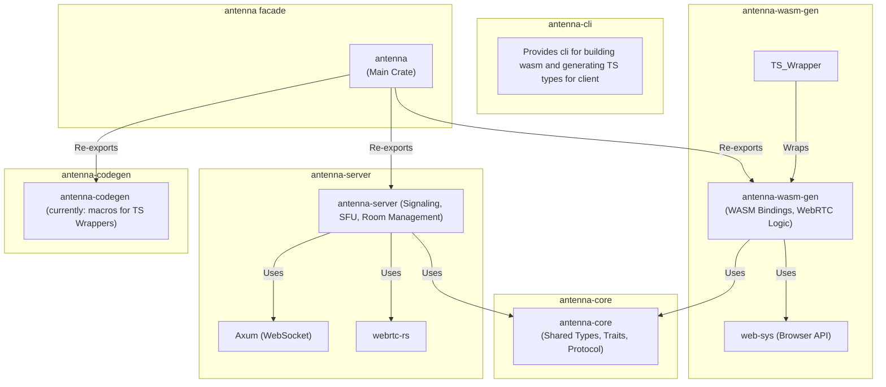
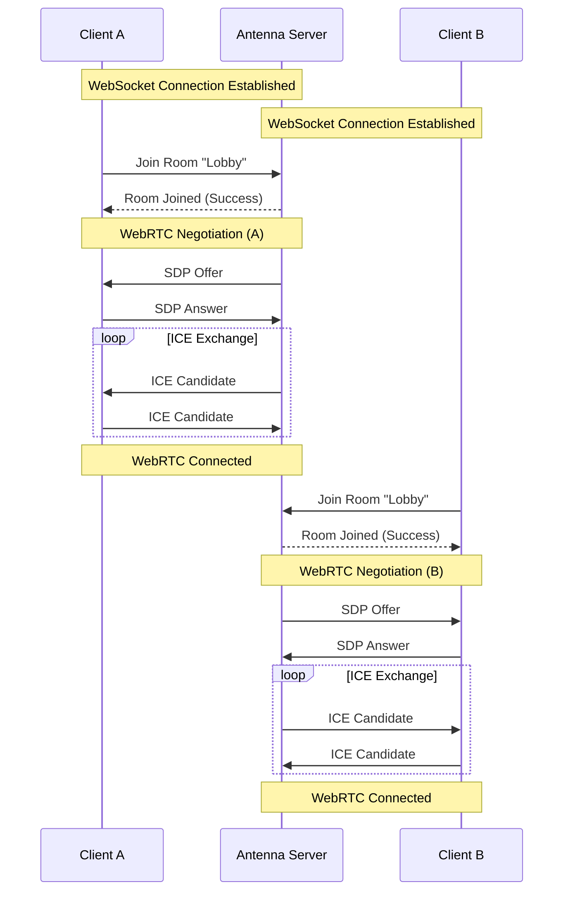

## Architecture and modules

### Crate graph

### Signaling

The signaling process in Antenna is designed to establish WebRTC connections between peers via a central server. It handles the exchange of SDP offers/answers and ICE candidates.

#### Connection Flow

1.  **WebSocket Connection**: The client connects to the server via WebSocket.
2.  **Join Room**: The client sends a request to join a specific room.
3.  **WebRTC Negotiation (SDP Exchange)**:
    *   This process establishes the parameters for the media session (codecs, encryption, etc.).
    *   The server (acting as an SFU) creates an **SDP Offer** and sends it to the client.
    *   The client processes the offer and responds with an **SDP Answer**.
4.  **ICE Candidate Exchange**: Both parties exchange ICE candidates (network paths) to establish connectivity.
5.  **Media Exchange**: Once connected, media tracks (audio/video) are flowed through the server.

