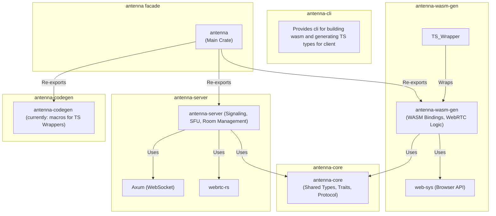
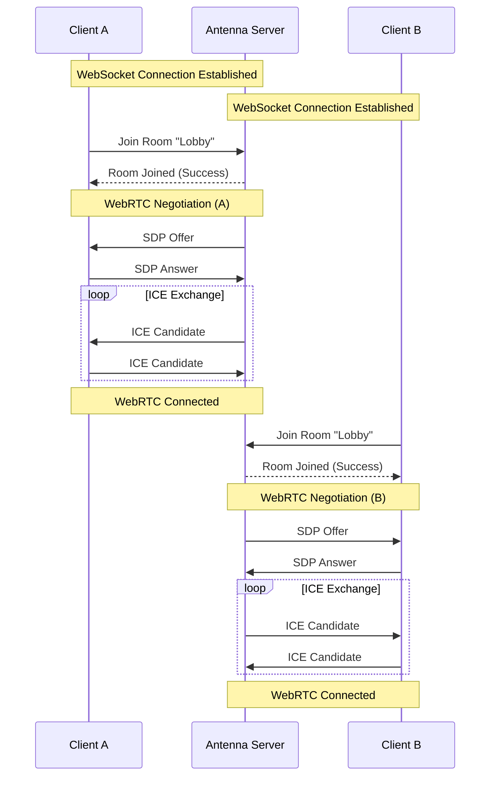
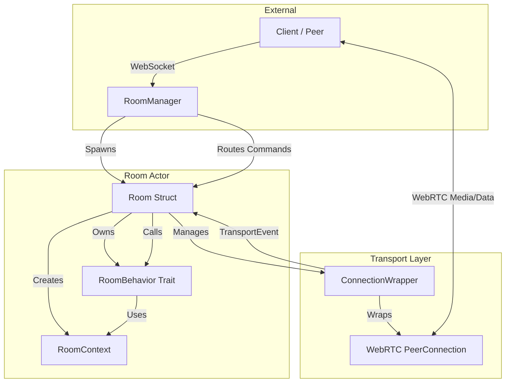
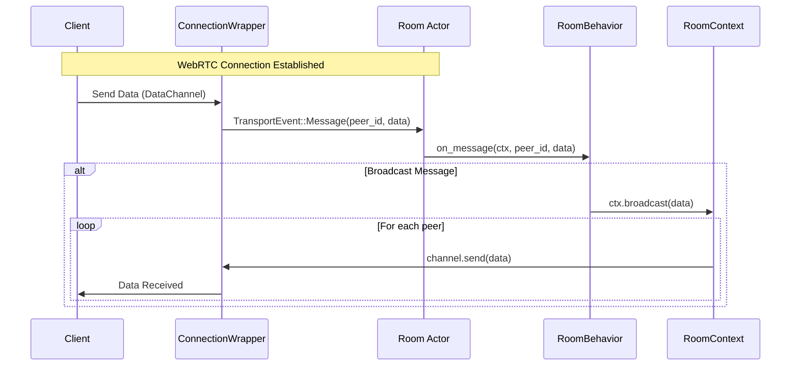
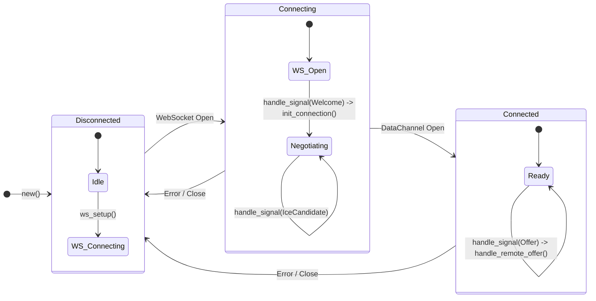

## Architecture and modules

### Crate graph

### Signaling

The signaling process in Antenna is designed to establish WebRTC connections between peers via a central server. It handles the exchange of SDP offers/answers and ICE candidates.

#### Connection Flow

### Room logic 

Antenna server provides room management logic: each room runs in its own task, managing interactions of its peer connections.

#### Key Components

*   **RoomManager**: Maintains a registry of active rooms and handles the creation of new `Room` actors, creating `tokio::spawn` task for each new room and provides mpsc senders to signaling handler to `ws_handler`.

*   **Room**: The central unit for a group of user sessions.
    *   **RoomBehavior**: Developer-defined implementation.
    *   **Peers Data**: A map of connected peers and their data channels.
    *   **Transports**: Manages WebRTC connections for each peer.
    *   **Room Loop**: Listens for external commands from signaling and internal webRTC event like messages and disconnections

*   **RoomContext**: A handle passed to `RoomBehavior` methods, providing access to room operations. It allows sending messages to specific peers (`send`) or broadcasting to all (`broadcast`).

*   **ConnectionWrapper**: Encapsulates the `RTCPeerConnection`. It handles the complexity of WebRTC: managing tracks, processing ICE candidates, and bridging WebRTC events to the `Room` actor via `TransportEvent`.

#### Data Flow

This architecture ensures that business logic (`RoomBehavior`) is decoupled from the low-level WebRTC transport details (`ConnectionWrapper`), making it easy to build custom applications on top of Antenna.

### Client Logic and Antenna Engine

The client-side logic is primarily handled by the `antenna-wasm-gen` crate, which provides an engine class that compiles to WebAssembly. 

#### AntennaEngine

The `AntennaEngine<T, E>` struct is the core of the client implementation, where `T` is the type of messages sent to the server and `E` is the type of events received from the server.

*   **Initialization**:
    *   `new(config: EngineConfig)`: Initializes the engine with the signaling server URL, room ID, and optional ICE server configuration.
    *   `ws_setup`: Establishes the WebSocket connection to the signaling server.

*   **Signaling Handling**:
    *   The engine listens for WebSocket messages (`SignalMessage`) and dispatches them to appropriate handlers:
        *   `Welcome`: Triggers the connection initialization (`init_connection`).
        *   `Offer`: Handles an incoming SDP offer from the server (`handle_remote_offer`).
        *   `Answer`: Processes an SDP answer from the server.
        *   `IceCandidate`: Adds remote ICE candidates to the peer connection.

*   **Data Channel**:
    *   `setup_data_channel`: Configures the data channel for binary message exchange.
    *   `send(msg: T)`: Serializes and sends a message to the server via the data channel. If the channel is not open, messages are queued.
    *   `dispatch_event`: Deserializes incoming binary packets and invokes the registered JavaScript event handler.
    *   
#### Engine State Graph

