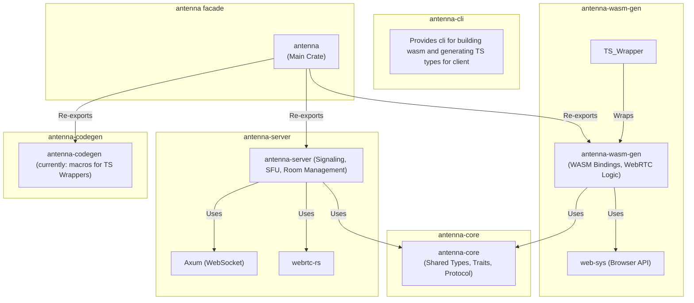
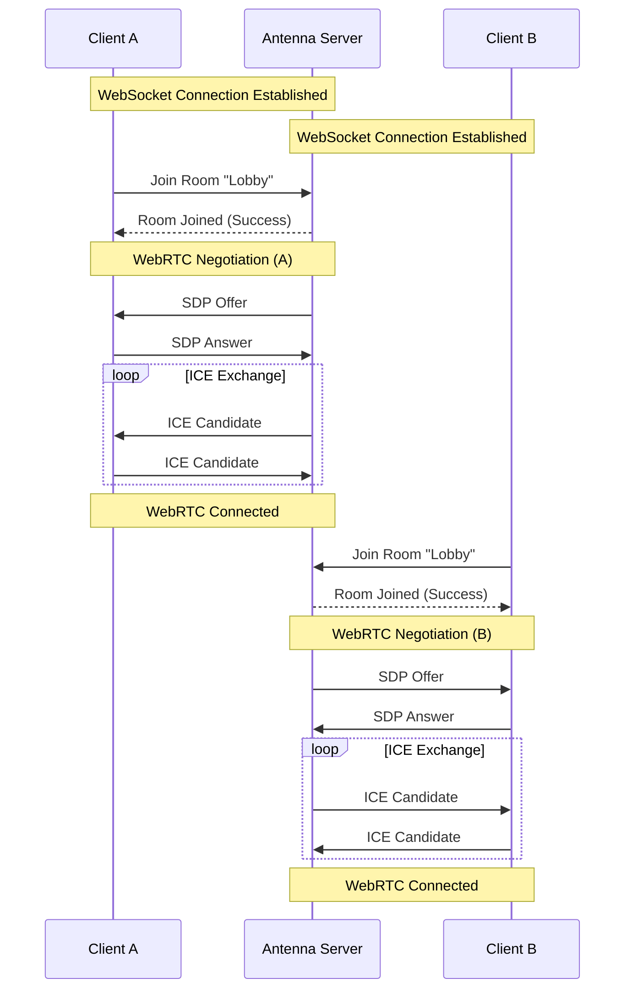
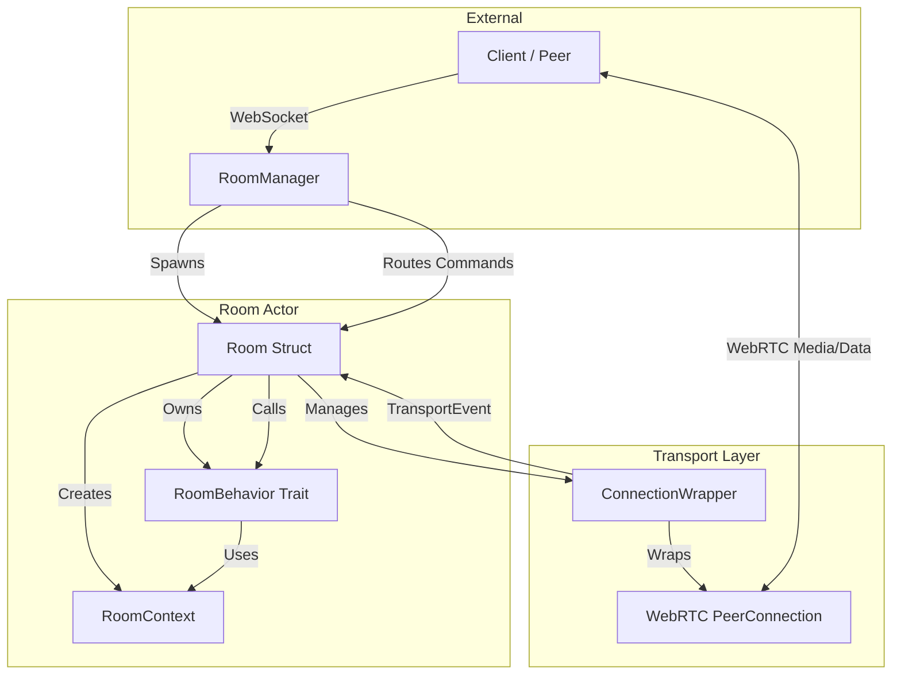
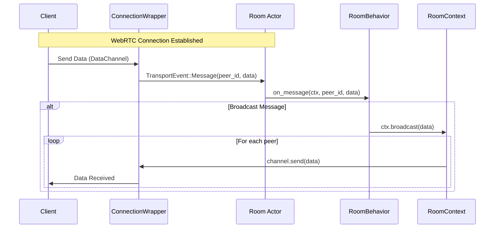

## Architecture and modules

### Crate graph

### Signaling

The signaling process in Antenna is designed to establish WebRTC connections between peers via a central server. It handles the exchange of SDP offers/answers and ICE candidates.

#### Connection Flow

1.  **WebSocket Connection**: The client connects to the server via WebSocket.
2.  **Join Room**: The client sends a request to join a specific room.
3.  **WebRTC Negotiation (SDP Exchange)**:
    *   This process establishes the parameters for the media session (codecs, encryption, etc.).
    *   The server (acting as an SFU) creates an **SDP Offer** and sends it to the client.
    *   The client processes the offer and responds with an **SDP Answer**.
4.  **ICE Candidate Exchange**: Both parties exchange ICE candidates (network paths) to establish connectivity.
5.  **Media Exchange**: Once connected, media tracks (audio/video) are flowed through the server.

### Room logic 

Antenna server provides room management logic: each room runs in its own task, managing interactions of its peer connections.

#### Key Components

*   **RoomManager**: Maintains a registry of active rooms and handles the creation of new `Room` actors, creating `tokio::spawn` task for each new room and provides mpsc senders to signaling handler to signaling-handling service.

*   **Room**: The central unit for a group of user sessions.
    *   **RoomBehavior**: User-defined implementation.
    *   **Peers Data**: A map of connected peers and their data channels.
    *   **Transports**: Manages WebRTC connections (`ConnectionWrapper`) for each peer.
    *   **Event Loop**: Listens for `RoomCommand` (external requests) and `TransportEvent` (internal WebRTC events like messages or disconnections).
    *   **Internal State**:
        *   `behavior`: Stores the user-defined `RoomBehavior` implementation.
        *   `peers_data`: A thread-safe map (`DashMap`) holding active data channels for each peer. This is shared with `RoomContext` to allow sending messages.
        *   `transports`: A map of `ConnectionWrapper` instances, one for each connected peer. This manages the low-level WebRTC connection state.
        *   `command_rx`: The receiver end of the channel for incoming `RoomCommand`s (e.g., Join, Disconnect) from the `RoomManager`.
        *   `transport_rx` & `transport_tx`: Internal channels used to receive events (`TransportEvent`) from `ConnectionWrapper`s (like new messages or ICE candidates) back into the main room loop.
        *   `signaling`: An interface to send signaling messages (SDP answers, ICE candidates) back to the client via WebSocket.
        *   `transport_config`: Configuration for WebRTC connections (ICE servers, etc.).
        *   `track_senders`: Manages media tracks. It maps track IDs to a broadcast channel, codec info, and stream ID, allowing media from one peer to be distributed to others.

*   **RoomBehavior (Trait)**: This is where developers implement their application-specific logic. It defines hooks for lifecycle events:
    *   `on_join`: Called when a peer successfully connects and the data channel is ready.
    *   `on_message`: Called when a binary message is received from a peer.
    *   `on_leave`: Called when a peer disconnects.

*   **RoomContext**: A handle passed to `RoomBehavior` methods, providing safe access to room operations. It allows sending messages to specific peers (`send`) or broadcasting to all (`broadcast`).

*   **ConnectionWrapper**: Encapsulates the `RTCPeerConnection`. It handles the complexity of WebRTC: managing tracks, processing ICE candidates, and bridging WebRTC events to the `Room` actor via `TransportEvent`.

#### Data Flow

1.  **Signaling**: A `JoinRequest` is sent via WebSocket. `RoomManager` forwards it to the `Room`.
2.  **Connection**: The `Room` creates a `ConnectionWrapper`, negotiates SDP, and establishes the WebRTC connection.
3.  **Interaction**:
    *   When a peer sends data, `ConnectionWrapper` fires a `TransportEvent::Message`.
    *   The `Room` loop catches this event and calls `behavior.on_message(ctx, peer_id, data)`.
    *   The behavior implementation uses `ctx.broadcast(data)` to relay the message to other peers.

This architecture ensures that business logic (`RoomBehavior`) is decoupled from the low-level WebRTC transport details (`ConnectionWrapper`), making it easy to build custom applications on top of Antenna.
