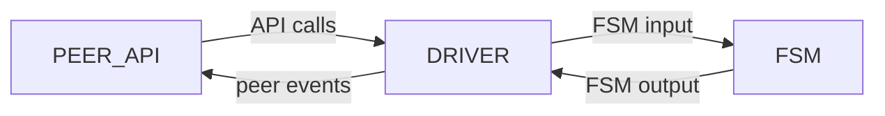
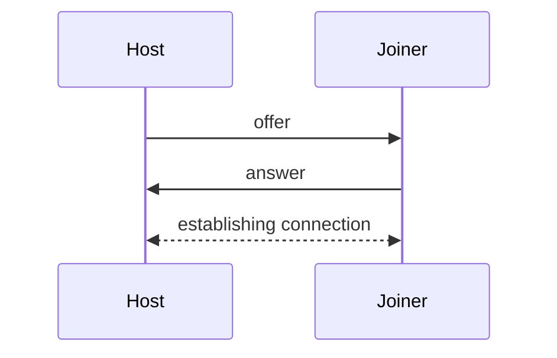
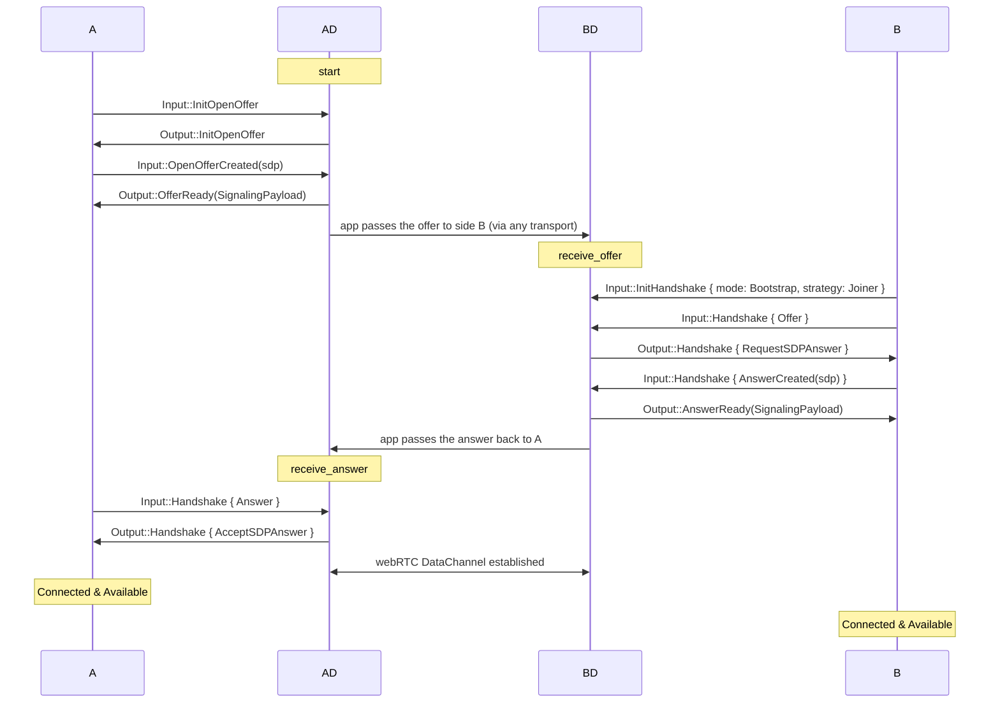
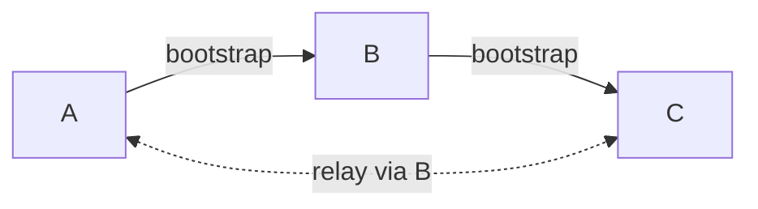
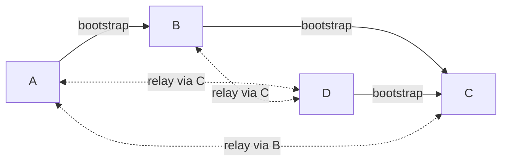
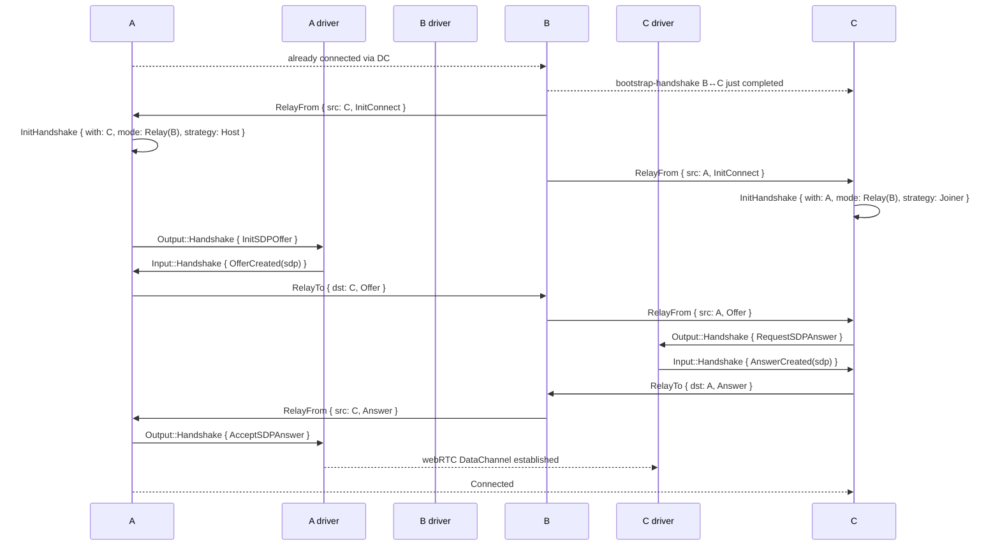

## Basic information

Antenna - SDK for building decentralized P2P over WebRTC. The SDK is designed to be maximally flexible for the user
while taking advantage of the WebRTC protocol, fully encapsulating its API and solving pressing problems like
signaling and reconnection on its own. Antenna is a cross-platform SDK and can be used in both browser and
native applications, though the focus is on the browser. The SDK is built on Antenna-protocol, which we'll discuss next.

## What problem does Antenna solve

WebRTC is the only way to establish a true P2P connection in a browser, but the WebRTC API is extremely low-level, and working with it directly is painful. Plain WebRTC only gives you a DataChannel and requires the application to manually perform the SDP exchange and maintain each peer connection separately. Antenna takes on:

- Mesh abstraction over the convoluted WebRTC.
- Mesh extension and stabilization: as soon as a new peer joins the mesh, it automatically connects to all participants; when individual connections in the mesh break, they self-heal.
- Identities and verification: each peer has a persistent ED25519 key, all SDP descriptions are signed when sent and verified when received, man-in-the-middle during the handshake is excluded.
- Cross-platform: a single sansIO core works with two platform drivers — web and native, despite the WebRTC implementations on these platforms being completely different.
- Signaling decoupled from the main logic: an optional bundled signaling server is provided with a minimal task only — a transport for the bootstrap handshake. The user can plug in any custom transport instead.

## Use cases

Antenna makes sense where P2P communication is needed, especially in the web environment:

- P2P chats;
- real-time multiplayer games;
- collaborative editing — shared documents, boards, code-sharing (Antenna does not implement CRDT logic itself — it can be built on top of message exchange).

Antenna is not suitable for large meshes (>~50 peers) — full mesh grows as N².

## Mesh structure

Antenna builds a full mesh: each peer holds a WebRTC connection with every other peer in the group.

This implies:

- any two peers exchange messages directly
- the failure of one peer does not break the rest of the mesh
- the number of connections grows as N², so the model is designed for small groups

## Peer structure

A peer consists of three nested modules: Peer, Driver, and FSM.



### Peer

Peer is the public API object through which the application controls the peer. It is platform-dependent, but the API is almost identical on
both platforms (more details in the API section).

### Driver

Driver is a platform-dependent layer between Peer and FSM. It translates Peer API calls into Input messages for the FSM, and
FSM Output into events for Peer; it manages external APIs: WebRTC and persistent storage. Implemented separately for each
platform: web (via WASM) and native Rust. It is precisely thanks to this layer that the FSM remains fully
platform-independent.

### FSM

FSM is the protocol's finite state machine, implemented in the sansIO philosophy: it synchronously accepts Input messages and returns
Output commands, without any external I/O. This isolation from the network API (and consequently from the platform) makes the
FSM fully platform-independent and easy to test.

# Antenna API

## Peer object

The library's main working object is `Peer<Msg>`, generic over the user's message type. The API provided by
Peer can be divided into 3 categories: providing connecting, sending messages, and the event subscription system.

### UserMsgPayload

The message type `Msg` must implement the `UserMsgPayload` trait. The trait is empty and is automatically implemented for any
type satisfying `Serialize + DeserializeOwned + Clone`.

### Connection API

The connection API allows performing a bootstrap connection between two peers and graceful disconnection.

It consists of 4 methods:

- `start` — initiates the handshake, creates and returns an offer, and transitions the peer into the awaiting-answer state.
- `receive_offer` — processes an offer, generates an answer based on it, and returns it, transitioning the peer into the state
  of awaiting a DataChannel connection.
- `receive_answer` — processes an answer and initiates the DataChannel connection between the peers, transitioning both into Connected
  and allowing them to start sending messages.
- `leave` — initiates leaving the mesh, first sending a disconnect message to all peers in the mesh.

```rust
// Side A
let offer = peer.start().await?;
let answer = somehow_get_from_b();
peer.receive_answer(&answer).await?;

// Side B
let offer = somehow_get_from_a();
let answer = peer.receive_offer(&offer).await?;
```

### Sending API

The sending API allows sending messages to other peers in the mesh.

- `send` — send a client message to a specific peer.
- `broadcast` — send a message to all peers in the mesh.

### Subscription API

The subscription API allows subscribing to client events of Peer. There are 2 methods in total:

- `subscribe` — subscribe to an event, returns an identifier.
- `unsubscribe` — unsubscribe from an event by identifier.

List of possible events:

- `Connected` — the current peer connected to the mesh.
- `UserMessage` — a message arrived from another peer.
- `Disconnected` — the current peer disconnected.
- `PeerConnected` — a remote peer joined the mesh.
- `PeerDisconnected` — a remote peer left the mesh.
- `PeerLost` — a remote peer disconnected unpredictably (the connection was lost).
- `Available` — the peer connected to everyone in the mesh and is ready to send messages.
- `Unavailable` — the peer is not connected to everyone in the mesh.

```rust
peer.subscribe(Event::PeerConnected(PeerCallback::from_fn(|peer_id| {
    println!("{peer_id} joined the mesh");
    Ok(())
})));

peer.subscribe(Event::UserMessage(MessageCallback::from_fn(|peer_id, msg: Message| {
    println!("from {peer_id}: {}", msg.text);
    Ok(())
})));
```

## Signaling server

Signaling server — a helper provided by the SDK that automates bootstrap connections. It manages room entities, which include the connected peers.

[Specification](./signaling-server.md)

## Signaling client

Signaling client — a built-in signaling-server client that automates the bootstrap handshake over WebSocket.

The client has 2 methods:

- `connect(url)` — open a WebSocket connection to the signaling server.
- `join(room_id, peer)` — enter a room and perform the bootstrap handshake with one of its participants.

The signaling client also installs a listener on the `Disconnect` event in order to leave the room correctly on `leave()`.

```rust
let client = SignalingClient::connect("wss://signaling.example.com/ws").await?;

// Instead of calling the bootstrap api described above:
client.join("my-room".to_string(), peer.clone()).await?;
```

## Platforms

### Web

The web version is compiled to WebAssembly via `wasm-bindgen`. Under the hood — the browser's WebRTC API, called from Rust code through browser system bindings. The application using the library compiles a wasm module and is invoked from JS code through an api.

Usage example: `minimal-chat`.

### Native

The native implementation is intended to be called from regular Rust code. It is built on the tokio runtime and uses the `webrtc-rs` implementation as the WebRTC API.

Usage example: `shell-chat`.

## ICE servers

WebRTC uses the ICE framework to punch a path between peers through NATs and firewalls. This requires auxiliary servers:

- **STUN** — helps a peer learn its public IP/port for a direct P2P connection. Covers most home NATs (full-cone, restricted-cone, port-restricted-cone) — about 80-90% of scenarios.
- **TURN** — a relay server that proxies traffic between peers when direct P2P is impossible (symmetric NAT, corporate firewalls, CGNAT, double NAT).

By default, antenna connects to public Google STUN. TURN antenna **does not provide** — it is the application's responsibility; the required TURN server is plugged in via `IceServerConfig::with_credentials`.

```rust
let ice_servers = vec![
    IceServerConfig::new(vec!["stun:stun.l.google.com:19302".into()]),
    IceServerConfig::with_credentials(
        vec!["turn:turn.example.com:3478".into()],
        "user".into(),
        "password".into(),
    ),
];
let peer = Peer::with_ice_servers(ice_servers);
```

If the application runs on a local network or with peers behind predictable NATs — TURN can be omitted.

## Handshake

Before two peers can exchange messages, they must perform a handshake. The Antenna handshake solves two tasks:

- **SDP exchange to establish the connection** — each side communicates its network configuration to the other: ICE candidates, DTLS fingerprints, and the rest per the WebRTC specification.
- **Identity verification** — each side ensures that the other party owns the public key under which it presented itself. This excludes man-in-the-middle (more details in Identity verifying).

Antenna does not dictate a specific transport for exchanging offer and answer — it can be the bundled signaling server, copy-paste, QR codes, or any custom channel. Peers are only required to pass two strings to each other.

Within the handshake, the sides take 2 roles — **Host** and **Joiner**: the host sends the offer, the joiner accepts it and returns the answer. After the handshake completes, the roles disappear — peers become equal.



Antenna distinguishes two handshake modes: **Bootstrap** (between two peers via an arbitrary external transport) and **Relay** (between two peers via an already connected intermediary). Details — in the Handshake mode section.

### Offer & Answer

Offer and Answer are handshake objects through which peers learn about each other. Each of them consists of a public key and a token signed by it. At the API level, both are passed as base64 strings (see Connection API).

#### Public key

ED25519 public key. Serves as a unique identifier for the peer in the mesh. Persistent, the storage method depends on the platform (`localStorage` for web, file for native).

#### Token

Generated by the biscuit library and stores the peer's SDP description — data needed by WebRTC to establish a connection. The token's contents are signed by the pair's private key and verified by the public key attached to the offer/answer (see the Identity verifying section).

### Handshake strategy

#### Host

The peer that sends the offer first. Lifecycle:

1. Creates an offer
2. Awaits an answer, accepts it
3. Establishes the DataChannel connection

#### Joiner

The peer that accepts an offer. Lifecycle:

1. Accepts the offer, generates an answer
2. Awaits connection establishment by the host

### Handshake mode

Antenna distinguishes two handshake modes:

- **Bootstrap** — for the first connection to a mesh. The application provides the signaling channel between the two peers (signaling server, copy-paste, QR code, any transport).
- **Relay** — for connecting to an already-connected mesh or for recovery after a disconnection. Signaling automatically goes through an already connected peer-intermediary on top of existing DataChannels; nothing is required from the application.

#### Bootstrap

A bootstrap connection requires an external transport, the responsibility for which lies with the application. This can be manual SDP transfer via copy-paste (as in `minimal-chat`), use of the bundled signaling server (as in `chat-with-signaling-server`), or any custom channel.

At the API level, as described above, the entire bootstrap flow collapses to a pair of calls: `peer.start()` → pass the offer → `peer.receive_offer()` → pass the answer → `peer.receive_answer()`

Detailed scheme of FSM internal messages (for contributors):



#### Relay

Relay handshake — a handshake between two peers that have no direct connection but share a common already-connected intermediary. Signaling goes through that intermediary's DataChannel, without involvement from the application or the signaling server. Thanks to relay, a newcomer needs one bootstrap connection to end up in a mesh of N peers — the remaining N-1 connections are built up automatically and always deterministically, which guarantees that the mesh will always be full at the protocol level.

Relay triggers in two cases:

- **Mesh extension** — when any existing peer completes a handshake with a newcomer, its FSM Connected branch dispatches relay-init for all of its Connected peers. This automatically completes the full mesh without additional bootstraps.
- **Reconnect** — after a connection loss, the FSM's reconnect-tick attempts to restore the link with the lost peer through a common live neighbor.

A and B are connected, we add C:



Then we add D:



Detailed scheme of the relay handshake at the FSM level.
Assumed that `A.id < C.id`, so A picks the Host role, C — Joiner.



### Handshake guarantees and properties

#### Mesh completeness after relay

**Property.** If a peer P bootstrap-connects to any peer Q from an already-connected full mesh M, then after the handshakes stabilize P ends up directly connected to every peer in M.

**Proof:** By implementation, at the moment the bootstrap handshake P↔Q transitions to Connected, Q emits a relay-init message for each `existing ∈ M \ {Q}`. Each such existing peer receives the init and initiates a counter relay-handshake with P via Q as the intermediary. After all handshakes complete — M ∪ {P} is again a full mesh.

#### Role consistency in a relay handshake

**Property.** In any relay handshake (mesh extension upon a new peer joining, or reconnect after a break), roles are distributed by identifier: the peer with the smaller ID becomes Host, the one with the larger — Joiner. Both sides choose their role independently and cannot pick the same one.

**Proof:**
The role choice happens in two places in the FSM: `handle_relay_signaling_from` (on receiving `RelayPayload::InitConnect`) and `handle_reconnect_attempt` (on tick). Both use the comparison `self.id < other`. Since the strict order on PeerID is antisymmetric, both sides arrive at a consistent decision without any exchange.

#### Merging two meshes

**Property.** If a peer P ∈ M₁ establishes a bootstrap connection with a peer Q ∈ M₂, where M₁ and M₂ are two independent full meshes (M₁ ∩ M₂ = ∅), then after the handshakes stabilize a single full mesh M₁ ∪ M₂ is obtained.

**Proof:**
After P–Q completes, we apply the mesh-completeness-after-relay property:

- to the pair (P, Q ∈ M₂): P ends up connected to all peers of M₂;
- to the pair (Q, P ∈ M₁): Q ends up connected to all peers of M₁.

Now both P and Q are connected to all of M₁ ∪ M₂ — both act as intermediaries for members of each other's meshes. For any pair (m₁ ∈ M₁ \ {P}, m₂ ∈ M₂ \ {Q}), both peers are connected to P (or Q), and the FSM's Connected branch on the intermediary, when adding a new connection, emits relay-init pairs for all existing peers. By induction over completed handshakes — every pair (m₁, m₂) eventually receives an invitation and connects via P or Q as the intermediary. The final mesh M₁ ∪ M₂ is full.

## Reconnection

On an unexpected DataChannel break, antenna automatically tries to restore the connection without requiring action from the user.

At the moment of the break, the FSM emits an event about the sudden loss of the peer, and periodically tries to restore the connection via a relay handshake with any common Connected intermediary.

The cycle stops:

- **on success** — the peer is Connected again, `PeerConnected` is emitted;
- **on attempt limit** — after several failures, reconnection ceases;
- **if no common intermediaries remain in the mesh** — a relay handshake is impossible, attempts cease immediately.

## Peer connection

### Message format

All frames going through DataChannel come in one of several kinds:

- **User message** — what the application sent via `send` / `broadcast`. Only this kind reaches user callbacks.
- **Relay signaling** — a pair of messages for forwarding signaling data between two peers via a common intermediary (see Handshake → Relay).
- **Explicit disconnect** — a notification on a peer's graceful exit.

The wire format of a frame is a JSON object with a tag-discriminator field for the message kind. DataChannel is used in default SCTP mode — **ordered + reliable**: messages are delivered without loss and in send order.

### System messages

System messages — all kinds except User payload. Their reception and sending pass through the FSM and the driver and do not reach the client. They are needed to perform background actions on the mesh to preserve guarantees.

#### Relay

To establish a handshake between two unconnected peers, a pair of relay messages is used:

- **RelayTo** — the sender sends to the intermediary saying "forward this to peer `dst`";
- **RelayFrom** — the intermediary forwards to the target peer saying "here is a message from `src`".

The payload inside a relay message is one of three kinds:

- **init** — an invitation to a relay handshake, indicating the peer to connect with;
- **offer** — SDP offer inside a relay handshake;
- **answer** — SDP answer inside a relay handshake.

#### Disconnect

A disconnect message is sent by the peer to all mesh participants on a graceful exit. On the web platform, sending happens automatically from `Drop` on `Peer` and from a `beforeunload` handler; on native — only on an explicit call to `peer.leave()`.

The difference graceful vs abrupt:

- **Graceful** (Disconnect message arrived) — `PeerDisconnected` is emitted on other peers, reconnection is not invoked.
- **Abrupt** (the connection broke without a Disconnect message) — on other peers the peer is marked as broken, and they begin a reconnection attempt.

### Cryptographic strength

Antenna protects three properties: message confidentiality, data integrity, and sender authenticity. They are realized by a combination of DTLS at the transport layer and ED25519 signatures in signaling data.

#### Transport privacy and integrity: DTLS

All WebRTC DataChannel connections are, per the specification, encrypted with DTLS — TLS over UDP/SCTP. DTLS provides symmetric encryption with session keys and a MAC on every packet. Session keys are established via Diffie-Hellman during the WebRTC handshake; the exchange of DTLS fingerprints occurs inside SDP.

Out of the box this gives protection against eavesdropping and modification of traffic after the DataChannel is established.

#### Identity and authenticity: ED25519 via biscuit

Each peer has a persistent ED25519 key pair. ED25519 is an elliptic curve in Edwards form: ~128-bit security, deterministic signatures (unlike ECDSA), fast verification. The public key simultaneously serves as a unique peer identifier in the mesh.

In the handshake, SDP descriptions are packed into a [biscuit token](https://www.biscuitsec.org/) — a container signed with the private key with a verifiable signature. This guarantees that the offer/answer truly comes from the claimed key owner and was not modified in-flight.

## Code structure

[More details here](./architecture.md)
