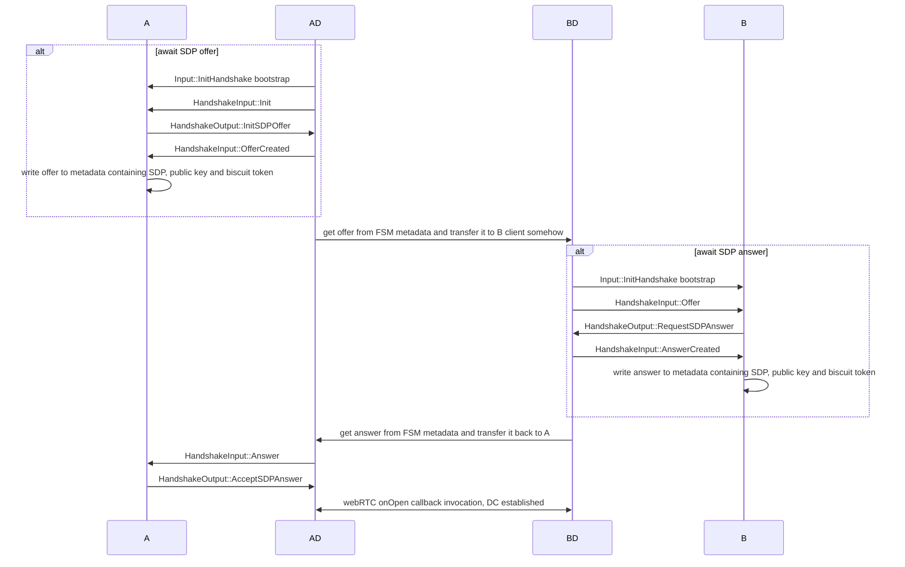
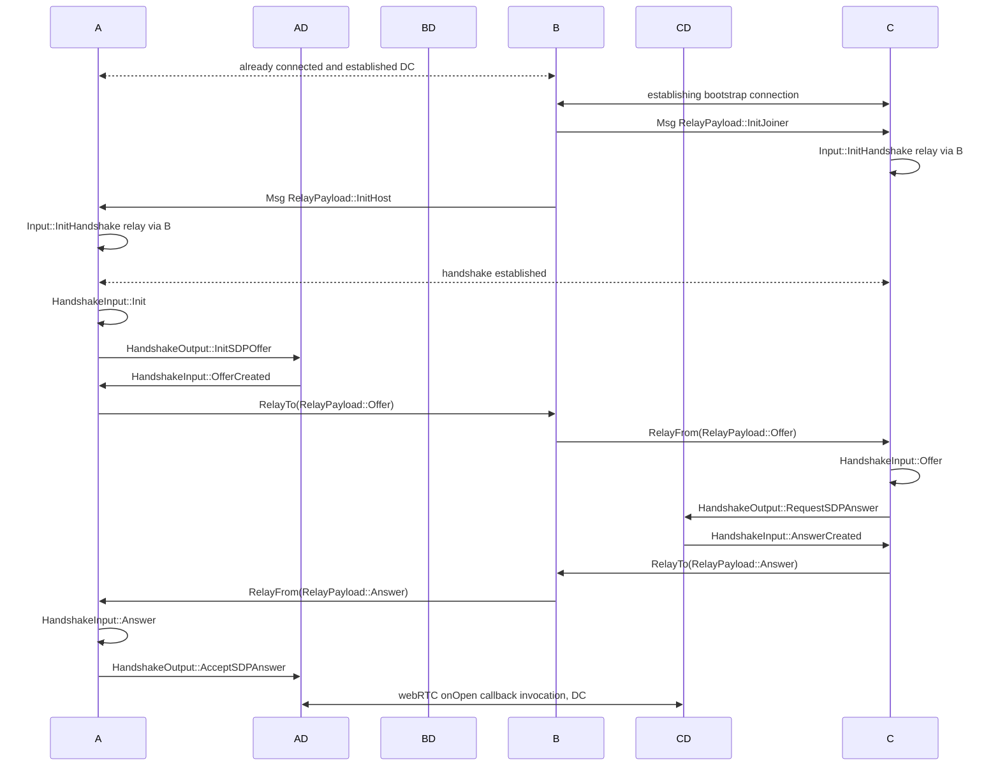

## Базовая информация

## Хэндшейк

## Режим хэндшейка

### Host

### Joiner

## Стратегия хэндшейка

### Bootstrap

```mermaid
sequenceDiagram
    participant A
    participant AD 
    participant BD
    participant B

    alt await SDP offer
        AD ->> A: Input::InitHandshake bootstrap
        AD ->> A: HandshakeInput::Init
        A ->> AD: HandshakeOutput::InitSDPOffer
        AD ->> A: HandshakeInput::OfferCreated
        A ->> A: write offer to metadata containing SDP, public key and biscuit token
    end
    AD ->> BD: get offer from FSM metadata and transfer it to B client somehow
    
    alt await SDP answer
        BD ->> B: Input::InitHandshake bootstrap
        BD ->> B: HandshakeInput::Offer
        B ->> BD: HandshakeOutput::RequestSDPAnswer
        BD ->> B: HandshakeInput::AnswerCreated
        B ->> B: write answer to metadata containing SDP, public key and biscuit token
    end

    BD ->> AD: get answer from FSM metadata and transfer it back to A
    AD ->> A: HandshakeInput::Answer
    A ->> AD: HandshakeOutput::AcceptSDPAnswer
    AD <<->> BD: webRTC onOpen callback invocation, DC established    
```

### Relay

```mermaid
sequenceDiagram
    participant A
    participant AD 
    participant BD
    participant B
    participant CD
    participant C

    A <<-->> B: already connected and established DC
    B <<->> C: establishing bootstrap connection
    B ->> C: Msg RelayPayload::InitJoiner
    C ->> C: Input::InitHandshake relay via B
    B ->> A: Msg RelayPayload::InitHost
    A ->> A: Input::InitHandshake relay via B
    A <<-->> C: handshake established
    A ->> A: HandshakeInput::Init
    A ->> AD: HandshakeOutput::InitSDPOffer
    AD ->> A: HandshakeInput::OfferCreated

    A ->> B: RelayTo(RelayPayload::Offer)
    B ->> C: RelayFrom(RelayPayload::Offer)

    C ->> C: HandshakeInput::Offer
    C ->> CD: HandshakeOutput::RequestSDPAnswer
    CD ->> C: HandshakeInput::AnswerCreated

    C ->> B: RelayTo(RelayPayload::Answer)
    B ->> A: RelayFrom(RelayPayload::Answer)

    A ->> A: HandshakeInput::Answer
    A ->> AD: HandshakeOutput::AcceptSDPAnswer
    AD <<->> CD: webRTC onOpen callback invocation, DC


```

## Сценарии хэндшейка

## Сообщения

## Переподключение
