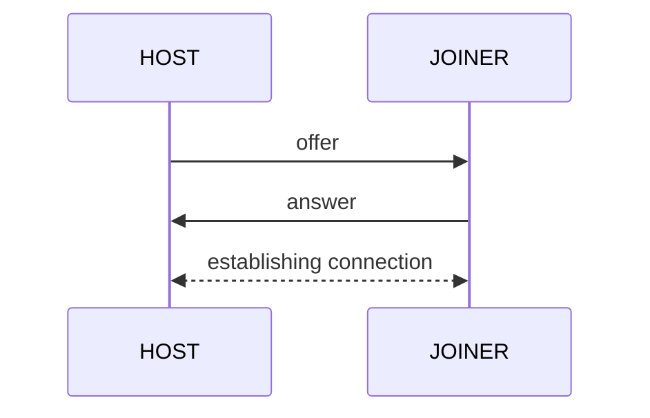
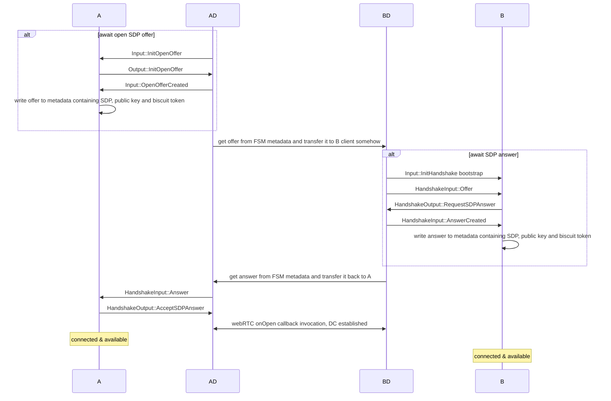
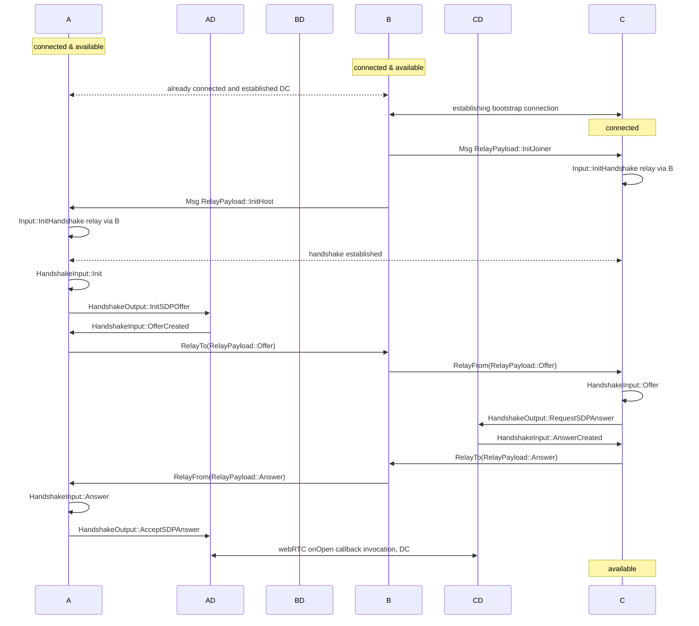

## Базовая информация

Antenna - SDP for building decentralized P2P over WebRTC. SDK спроектирован быть максимально гибким для пользователя, используя при этом преимущества протокола webRTC, при этом полностью инкапсулируя его API и решая насущные задачи вроде сигналинга и реконнекта самостоятельно. Antenna кросплатформенный SDK и может быть использован как в браузерных, так и в нативных приложениях, хоть фокус на браузере. SDK построен на Antenna-protocol, о котором мы поговорим далее. 

## Identity

## Discovery

## Peer structure

Пир состоит из двух модулей: FSM и Driver. 

FSM является синхронным обработчиком (конечным автоматом) и отвечает за всю протокольную логику и управление состоянием подключений. Является платформонезависимым. 

Driver является платформеннозависимой прослойкой и обрабатывает ввод пользователя, обеспечивает вывод и управляет внешними API: webRTC, персистентного хранилища. Driver реализован отдельно для каждой из платформ: в данный момент поддерживается web и native.

### FSM

### Driver

## Handshake

Для установки соединения между пирами необходимо провести хандшейк. В ходе antenna-хандшейка решается две проблемы: обмен SDP-контрактами и распознавание IDENTITY друг друга (TODO написать подробнее).

### SDP-negotiation

### Identity negotiation

Хандшейк спроектирован так, чтобы минимизировать делегацию сигналинг-части на юзера, но при этом не завязываться на конкретном инструменте сигналинга. В ходе хандшейка два пира выбирают свои роли: Host и Joiner. В ходе хандшейка они обмениваются информацией друг о друге, что позволяет установить соединение - offer, answer. Host отправляет offer, а joiner принимает его и отправляет answer, после чего host initiates peer connection Абстракто, хэндшейк представляет из себя следующую картину:

Ханшдейк бывает двух видов: Bootstrap и Relay. TODO кратко описать различия

### Bootstrap

Подробная схема bootstrap-соединения:

### Relay

Подробная схема relay-соединения:

Важно отметить, что после прохождения хэндшейка и установки PeerConnection, иерархия между пирами "хост-джоинер" пропадает и пиры становятся полностью равноправными.

## Peer connection

### Message format

Тип Antenna-сообщения полностью user-defined и должен лишь реализовывать Deserialize, Serialize и Clone, чтобы свободно работать в рамках соединения. Сам способ сериализации определяется юзером. 