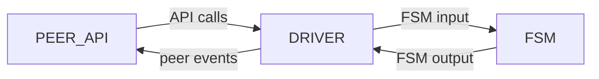
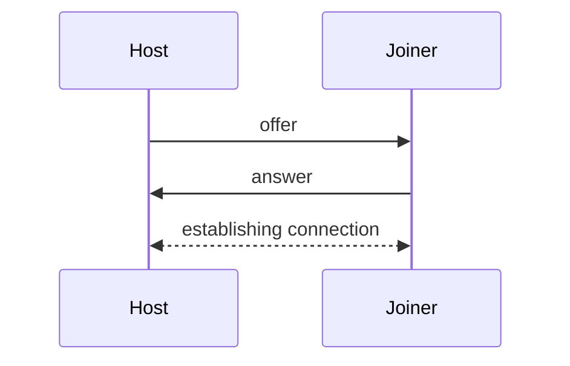
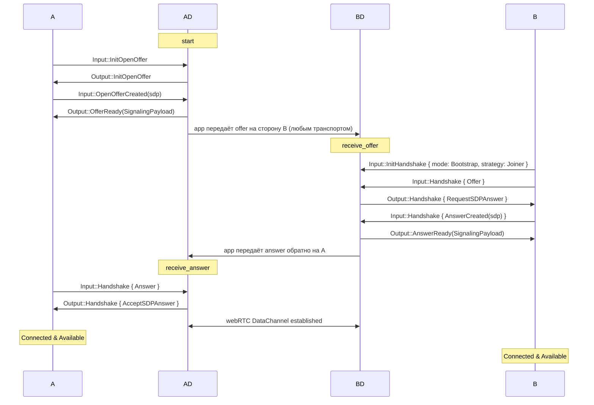
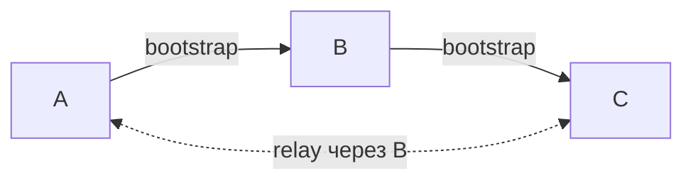
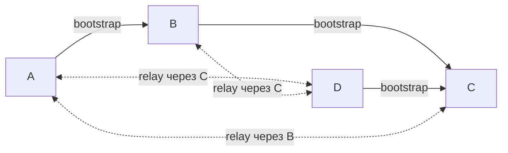
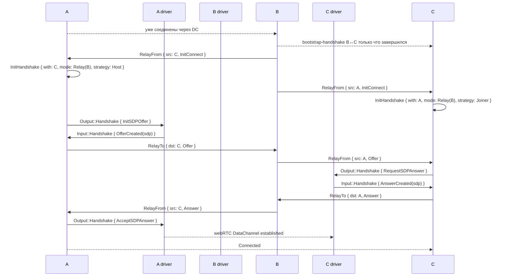

## Базовая информация

Antenna - SDK for building decentralized P2P over WebRTC. SDK спроектирован быть максимально гибким для пользователя,
используя при этом преимущества протокола webRTC, при этом полностью инкапсулируя его API и решая насущные задачи вроде
сигналинга и реконнекта самостоятельно. Antenna кросплатформенный SDK и может быть использован как в браузерных, так и в
нативных приложениях, хоть фокус на браузере. SDK построен на Antenna-protocol, о котором мы поговорим далее.

## Какую проблему решает Antenna

webRTC — единственный способ установить истинное P2P-соединение в браузере, однако webRTC API крайне низкоуровневый, и работать с ним напрямую — боль. Чистый webRTC даёт только DataChannel и требует от приложения вручную провести SDP-обмен и поддерживать каждое peer connection отдельно. Antenna берёт на себя:

- Mesh-абстракция поверх запутанного webRTC.
- Mesh-расширение и стабилизация: как только новый пир присоединяется к мешу, он автоматически подключается ко всем участникам; при разрыве отдельных соединений в меше они самовосстанавливаются.
- Идентичности и верификация: каждый пир имеет персистентный ED25519-ключ, все SDP-дескрипции подписываются при отправке и верифицируются при получении, Man-in-the-Middle в ходе handshake'а исключён.
- Кроссплатформенность: одно sansIO-ядро работает с двумя platform-driver'ами — web и native, несмотря на то, что сами реализации webRTC на этих платформах абсолютно разные.
- Отделенный от основной логики сигналинг: предоставляется опциональный встроенный сигналинг-сервер только с минимальной задачей — транспорт для bootstrap-handshake'а. Пользователь может подключить любой свой транспорт вместо него.

## Сценарии использования

Antenna имеет смысл там, где нужна P2P-коммуникация, особенно в web-среде:

- P2P-чаты и комнатные мессенджеры;
- real-time multiplayer-игры;
- collaborative editing — общие документы, доски, кодшеринг (Antenna не реализует CRDT-логику сама — её можно построить поверх обмена сообщениями).

Antenna не подходит для больших мешей (>~50 пиров) — full mesh растёт как N².

## Структура меша

Antenna строит полный меш: каждый пир держит webRTC-соединение с каждым другим пиром в группе.

Из этого следует:

- любые два пира обмениваются сообщениями напрямую
- падение одного пира не разрывает остальной mesh
- число соединений растёт как N², поэтому модель рассчитана на небольшие группы

## Структура пира

Пир состоит из трех вложенных модулей: Peer, Driver и FSM.



### Peer

Peer — публичный API-объект, через который приложение управляет пиром. Он платформозависим, но API почти идентично на
обеих платформах (подробнее в секции API).

### Driver

Driver — платформозависимая прослойка между Peer и FSM. Транслирует вызовы Peer API в Input-сообщения для FSM, а
Output FSM — в события для Peer; управляет внешними API: webRTC и персистентным хранилищем. Реализован отдельно для каждой
платформы: web (через WASM) и нативный раст. Именно благодаря этому слою FSM остаётся полностью
платформо-независимым.

### FSM

FSM — конечный автомат протокола, реализованный в sansIO-философии: синхронно принимает Input-сообщения и возвращает
Output-команды, без какого-либо внешнего I/O. Такая изоляция от сетевого API (а следовательно и от платформы) делает
FSM полностью платформо-независимым и легко тестируемым.

# Antenna API

## Peer object

Главный рабочий объект библиотеки — `Peer<Msg>`, generic над пользовательским типом сообщения. API, предоставляемое
Peer, можно разделить на 3 категории: обеспечение connecting, отправку сообщений и систему подписок на события.

### UserMsgPayload

Тип сообщения `Msg` должен реализовывать трейт `UserMsgPayload`. Трейт пустой и автоматически реализуется для любого
типа, удовлетворяющего `Serialize + DeserializeOwned + Clone`.

### Connection API

API соединений позволяет проводить bootstrap-соединение между двумя пирами и graceful disconnection.

Состоит из 4 методов:

- `start` — инициирует хандшейк, создавая и возвращая offer и переводя пир в состояние ожидания ансвера.
- `receive_offer` — обрабатывает оффер, генерирует на его основе ансвер и возвращает его, переводя пир в состояние
  ожидания соединения по DataChannel.
- `receive_answer` — обрабатывает ансвер и инициирует DataChannel-соединение между пирами, переводя обоих в Connected
  и позволяя начать отправлять сообщения.
- `leave` — инициирует выход из меша, предварительно рассылая disconnect-сообщение всем пирам в меше.

```rust
// Сторона A
let offer = peer.start().await?;
let answer = somehow_get_from_b();
peer.receive_answer(&answer).await?;

// Сторона B
let offer = somehow_get_from_a();
let answer = peer.receive_offer(&offer).await?;
```

### Sending API

Sending API позволяет отправлять сообщения другим пирам в меше.

- `send` — отправить клиентское сообщение определённому пиру.
- `broadcast` — отправить сообщение всем пирам в меше.

### Subscription API

Subscription API позволяет подписываться на клиентские события Peer. Всего есть 2 метода:

- `subscribe` — подписаться на событие, возвращает идентификатор.
- `unsubscribe` — отписаться от события по идентификатору.

Список возможных событий:

- `Connected` — текущий пир подключился к мешу.
- `UserMessage` — пришло сообщение от другого пира.
- `Disconnected` — текущий пир отсоединился.
- `PeerConnected` — remote пир присоединился к мешу.
- `PeerDisconnected` — remote пир отсоединился от меша.
- `PeerLost` — remote пир непредсказуемо отсоединился (пропало соединение).
- `Available` — пир соединился со всеми в меше и готов к отправке сообщений.
- `Unavailable` — пир не соединился со всеми в меше.

```rust
peer.subscribe(Event::PeerConnected(PeerCallback::from_fn(|peer_id| {
    println!("{peer_id} joined the mesh");
    Ok(())
})));

peer.subscribe(Event::UserMessage(MessageCallback::from_fn(|peer_id, msg: Message| {
    println!("from {peer_id}: {}", msg.text);
    Ok(())
})));
```

## Signaling server

Signaling server - предоставляемый SDK хелпер, автоматизирующий bootstrap-соединения. Он управляет сущностями комнат, включающих в себя подключенные пиры.

[Спецификация](./signaling-server.md)

## Signaling client

Signaling client — встроенный клиент сигналинг-сервера, автоматизирующий bootstrap-handshake через WebSocket.

У клиента 2 метода:

- `connect(url)` — открыть WebSocket-соединение с сигналинг-сервером.
- `join(room_id, peer)` — войти в комнату и провести bootstrap-handshake с одним из её участников.

Также signaling-клиент устанавливает listener на событие `Disconnect`, чтобы корректно покинуть комнату при `leave()`.

```rust
let client = SignalingClient::connect("wss://signaling.example.com/ws").await?;

// Вместо вызова bootstrap api, описанного выше:
client.join("my-room".to_string(), peer.clone()).await?;
```

## Платформы

### Web

Веб-версия компилируется в WebAssembly через `wasm-bindgen`. Под капотом — браузерное webRTC API, вызываемое в rust-коде через браузерные системные биндинги. Приложение, используемое библиотеку, компилируется wasm-модуль и вызывается из JS-кода через api.

Пример использования: `minimal-chat`.

### Native

Нативная реализация предназначена для вызова в обычном rust коде. Она построена на tokio-рантайме и использует реализацию `webrtc-rs` в качестве webRTC-API.

Пример использования: `shell-chat`.

## Handshake

Перед тем как два пира смогут обмениваться сообщениями, они должны провести handshake. Antenna-handshake решает две задачи:

- **Обмен SDP для установки соединения** — каждая сторона сообщает другой свою сетевую конфигурацию: ICE-кандидаты, DTLS-фингерпринты и прочее по спецификации webRTC.
- **Верификация идентичности** — каждая сторона удостоверяется, что собеседник владеет тем публичным ключом, под которым представился. Это исключает man-in-the-middle (подробнее в Identity verifying).

Конкретный транспорт для обмена offer и answer antenna не диктует — это может быть встроенный signaling-сервер, копи-паст, QR-коды или любой свой канал. От пиров требуется лишь передать друг другу две строки.

В рамках handshake'а стороны принимают 2 роли - **Host** и **Joiner**: host отправляет offer, joiner принимает его и возвращает answer. После завершения handshake'а роли пропадают — пиры становятся равноправными.



Antenna различает два режима handshake'а: **Bootstrap** (между двумя пирами через произвольный внешний транспорт) и **Relay** (между двумя пирами через уже подключённого посредника). Подробности — в разделе Handshake mode.

### Offer & Answer

Offer и Answer — handshake-объекты, через которые пиры узнают друг о друге. Каждый из них состоит из публичного ключа и подписанного им токена. На уровне API оба передаются как base64-строки (см. Connection API).

#### Публичный ключ

ED25519-публичный ключ. Служит уникальным идентификатором пира в меше. Персистентен, способ хранения зависит от платформы (`localStorage` для web, файл для native).

#### Токен

Генерируется библиотекой biscuit и хранит SDP-дескрипцию пира — данные, нужные webRTC для установки соединения. Содержимое токена подписывается приватным ключом пары и верифицируется публичным ключом, прикреплённым к offer/answer (см. раздел Identity verifying).

### Handshake strategy

#### Host

Пир, первым отправляющий offer. Жизненный цикл:

1. Создаёт offer
2. Ожидает answer, принимает его
3. Устанавливает DataChannel-соединение

#### Joiner

Пир, принимающий offer. Жизненный цикл:

1. Принимает offer, генерирует answer
2. Ожидает установки соединения хостом

### Handshake mode

Antenna различает два режима handshake'а:

- **Bootstrap** — для первого подключения к меш'у. Сигналинг-канал между двумя пирами обеспечивает приложение (signaling-сервер, копи-паст, QR-код, любой транспорт).
- **Relay** — для подключения к уже связному меш'у или для recover'а после разрыва. Сигналинг автоматически идёт через уже подключённого пира-посредника поверх существующих DataChannel'ов; от приложения ничего не требуется.

#### Bootstrap

Bootstrap-соединению необходим внешний транспорт, ответственность за который лежит на приложении. Это может быть ручная передача SDP копи-пастом (как в `minimal-chat`), использование встроенного signaling-сервера (как в `chat-with-signaling-server`) или любой свой канал.

На уровне API, как было описано выше, весь bootstrap-flow свёрнут до пары вызовов: `peer.start()` → передать offer → `peer.receive_offer()` → передать answer → `peer.receive_answer()`

Подробная схема внутренних сообщений FSM (для контрибьюторов):



#### Relay

Relay-handshake — это handshake между двумя пирами, у которых нет прямого соединения, но есть общий уже подключённый посредник. Сигналинг идёт через DataChannel этого посредника, без участия приложения и signaling-сервера. Благодаря relay новичку нужно одно bootstrap-соединение, чтобы оказаться в меше из N пиров — остальные N-1 соединений достраиваются автоматически и всегда детерминировано, что гарантирует что меш всегда будет полным на уровне протокола.

Relay срабатывает в двух случаях:

- **Mesh-extension** — когда любой existing-пир завершает handshake с новичком, его Connected-ветка FSM рассылает relay-init для всех своих Connected-пиров. Это автоматически достраивает full mesh без дополнительных bootstrap'ов.
- **Reconnect** — после потери соединения reconnect-tick FSM пытается восстановить связь с потерянным пиром через общего живого соседа.

A и B соединены, добавляем C:



Затем добавляем D:



Подробная схема relay-handshake'а на уровне FSM.
предполагается `A.id < C.id`, поэтому A выбирает роль Host, C — Joiner.



### Гарантии и свойства хандшейков

#### Полнота меша после relay

**Свойство.** Если пир P через bootstrap подключается к любому пиру Q из уже связного полного меша M, то после стабилизации handshake'ов P оказывается соединён напрямую с каждым пиром в M.

**Доказательство:** По реализации, в момент перехода bootstrap-handshake'а P↔Q в Connected, Q эмитит relay-init-сообщение для каждого `existing ∈ M \ {Q}`. Каждый такой existing получает init и инициирует встречный relay-handshake с P через Q как посредника. После завершения всех handshake'ов — M ∪ {P} снова полный mesh.

#### Согласованность ролей в relay-handshake

**Свойство.** В любом relay-handshake'е (mesh-расширение при подключении нового пира или reconnect после разрыва) роли распределяются по идентификаторам: пир с меньшим ID становится Host, с большим — Joiner. Обе стороны выбирают свою роль независимо и не могут выбрать одинаковую.

**Доказательство:**
Выбор роли происходит в двух местах FSM: `handle_relay_signaling_from` (при получении `RelayPayload::InitConnect`) и `handle_reconnect_attempt` (по тику). Оба используют сравнение `self.id < other`. Поскольку строгий порядок на PeerID антисимметричен, обе стороны приходят к согласованному решению без какого-либо обмена.

#### Слияние двух мешей

**Свойство.** Если пир P ∈ M₁ устанавливает bootstrap-соединение с пиром Q ∈ M₂, где M₁ и M₂ — два независимых полных меша (M₁ ∩ M₂ = ∅), то после стабилизации handshake'ов получается единый полный меш M₁ ∪ M₂.

**Доказательство:**
После завершения P-Q применяем свойство полноты меша после relay:

- к паре (P, Q ∈ M₂): P оказывается соединён со всеми пирами M₂;
- к паре (Q, P ∈ M₁): Q оказывается соединён со всеми пирами M₁.

Теперь и P, и Q соединены со всем M₁ ∪ M₂ — оба выступают посредниками перед членами мешей друг друга. Для любой пары (m₁ ∈ M₁ \ {P}, m₂ ∈ M₂ \ {Q}) оба пира соединены с P (или Q), и Connected-ветка FSM на посреднике при добавлении нового соединения эмитит relay-init-пары для всех existing-пиров. По индукции на завершившихся handshake'ах — каждая пара (m₁, m₂) рано или поздно получает приглашение и соединяется через P или Q как посредника. Финальный mesh M₁ ∪ M₂ — полный.

## Peer connection

### Message format

Тип Antenna-сообщения полностью user-defined и должен лишь реализовывать Deserialize, Serialize и Clone, чтобы свободно
работать в рамках соединения. Сам способ сериализации определяется юзером.

### System messages

Системные сообщения - сообщения, транслируемые через DataChannel между пирами, однако не использующиеся в юзер-сайд коммуникации.

#### Relay

Сообщения RelaySignalingTo и RelaySignalingFrom используются для установления хандшейка между двумя несоединенными пирами. Пир-посредник слушает RelaySignalingTo и отправляет RelaySignalingFrom.

#### Disconnect

Сообщение отправляется пиром всем участникам меша, когда он хочет выйти из меша. Сообщение пытается отправляется автоматически в деструкторе пира (+ при закрытии страницы в web-имплементации). Без отправки этого сообщения пиры попытаются восстановить соединение.

### Криптографическая надежность

#### Privacy

Приватность передаваемых данных обеспечивается с помощью протокола DTLS, которым защищенны все webRTC DataChannel-соединения по спецификации. Обмен DTLS-фингерпринтами происходит в процессе хандшейка, вместе с обменом SDP.

#### Identity verifying

Для верификации идентичностей других пиров, протокол использует KeyPair ed25519. Публичный ключ является идентификатором пира. При установке начальной стадии хандшейка, пиры получают и запоминают публичные ключи друг друга. Все передаваемые в ходе хандшейка SDP-дескрипции подписываются и верифицируются на каждой из стадий, благодаря этому вмешаться в хандшейк вредоносному пиру невозможно.

## Структура кода

[Подробнее здесь](./architecture.md)
