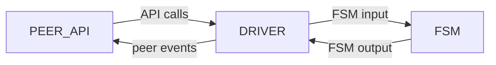
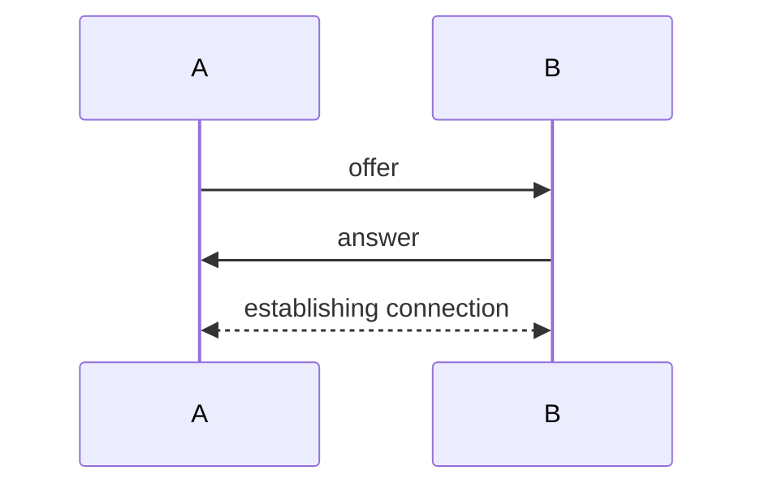
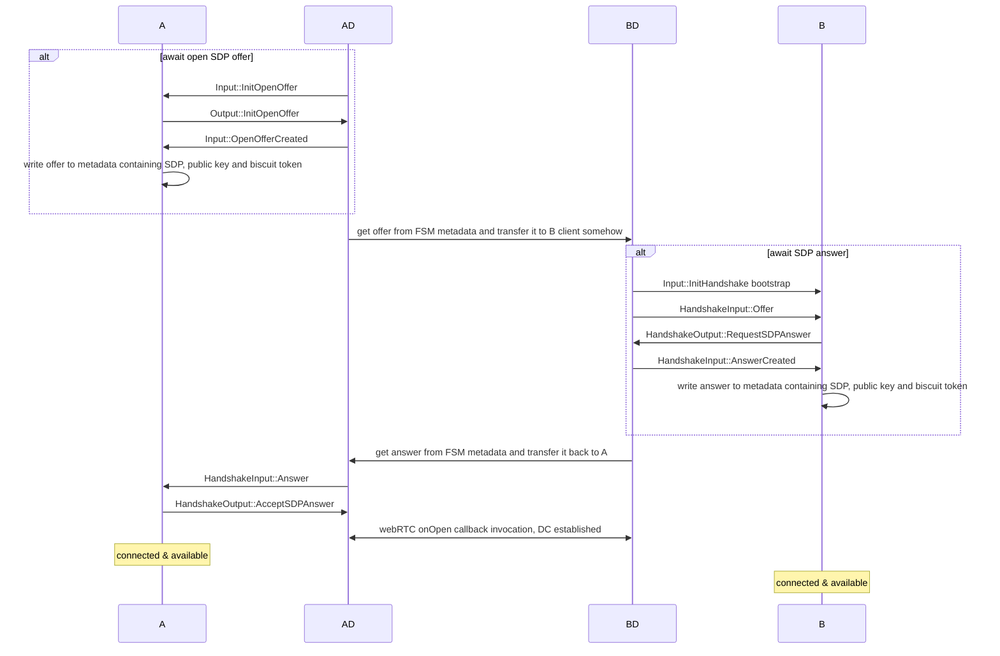
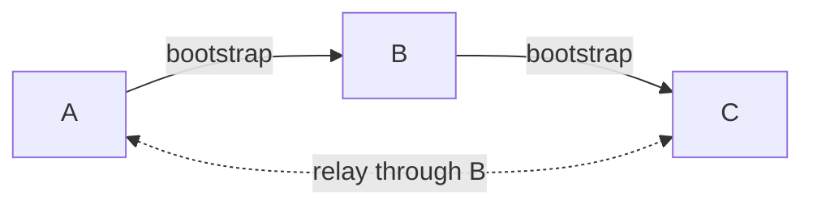
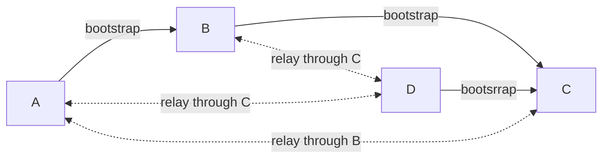
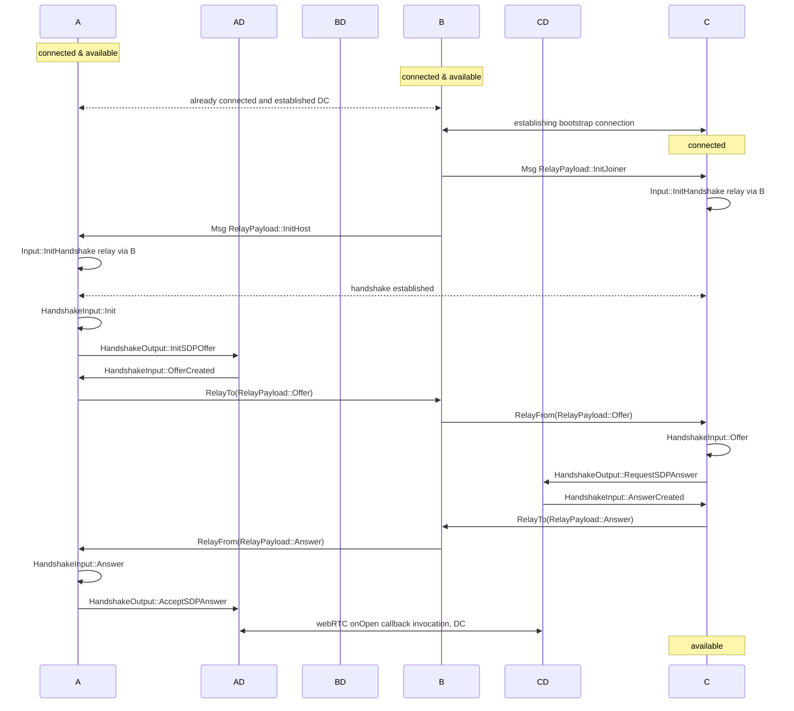

## Базовая информация

Antenna - SDK for building decentralized P2P over WebRTC. SDK спроектирован быть максимально гибким для пользователя,
используя при этом преимущества протокола webRTC, при этом полностью инкапсулируя его API и решая насущные задачи вроде
сигналинга и реконнекта самостоятельно. Antenna кросплатформенный SDK и может быть использован как в браузерных, так и в
нативных приложениях, хоть фокус на браузере. SDK построен на Antenna-protocol, о котором мы поговорим далее.

## Какую проблему решает Antenna

webRTC — единственный способ установить истинное P2P-соединение в браузере, однако webRTC API крайне низкоуровневый, и работать с ним напрямую — боль. Чистый webRTC даёт только DataChannel и требует от приложения вручную провести SDP-обмен и поддерживать каждое peer connection отдельно. Antenna берёт на себя:

- Mesh-абстракция поверх запутанного webRTC.
- Mesh-расширение и стабилизация: как только новый пир присоединяется к мешу, он автоматически подключается ко всем участникам; при разрыве отдельных соединений в меше они самовосстанавливаются.
- Идентичности и верификация: каждый пир имеет персистентный ED25519-ключ, все SDP-дескрипции подписываются при отправке и верифицируются при получении, Man-in-the-Middle в ходе handshake'а исключён.
- Кроссплатформенность: одно sansIO-ядро работает с двумя platform-driver'ами — web и native, несмотря на то, что сами реализации webRTC на этих платформах абсолютно разные.
- Отделенный от основной логики сигналинг: предоставляется опциональный встроенный сигналинг-сервер только с минимальной задачей — транспорт для bootstrap-handshake'а. Пользователь может подключить любой свой транспорт вместо него.

## Сценарии использования

Antenna имеет смысл там, где нужна P2P-коммуникация, особенно в web-среде:

- P2P-чаты и комнатные мессенджеры;
- real-time multiplayer-игры;
- collaborative editing — общие документы, доски, кодшеринг (Antenna не реализует CRDT-логику сама — её можно построить поверх обмена сообщениями).

Antenna не подходит для больших мешей (>~50 пиров) — full mesh растёт как N².

## Структура меша

Antenna строит полный меш: каждый пир держит webRTC-соединение с каждым другим пиром в группе.

Из этого следует:

- любые два пира обмениваются сообщениями напрямую
- падение одного пира не разрывает остальной mesh
- число соединений растёт как N², поэтому модель рассчитана на небольшие группы

## Структура пира

Пир состоит из трех вложенных модулей: Peer, Driver и FSM.



### Peer

Peer — публичный API-объект, через который приложение управляет пиром. Он платформозависим, но API почти идентично на
обеих платформах (подробнее в секции API).

### Driver

Driver — платформозависимая прослойка между Peer и FSM. Транслирует вызовы Peer API в Input-сообщения для FSM, а
Output FSM — в события для Peer; управляет внешними API: webRTC и персистентным хранилищем. Реализован отдельно для каждой
платформы: web (через WASM) и нативный раст. Именно благодаря этому слою FSM остаётся полностью
платформо-независимым.

### FSM

FSM — конечный автомат протокола, реализованный в sansIO-философии: синхронно принимает Input-сообщения и возвращает
Output-команды, без какого-либо внешнего I/O. Такая изоляция от сетевого API (а следовательно и от платформы) делает
FSM полностью платформо-независимым и легко тестируемым.

# Antenna API

## Peer object

Главный рабочий объект библиотеки — `Peer<Msg>`, generic над пользовательским типом сообщения. API, предоставляемое
Peer, можно разделить на 3 категории: обеспечение connecting, отправку сообщений и систему подписок на события.

### UserMsgPayload

Тип сообщения `Msg` должен реализовывать трейт `UserMsgPayload`. Трейт пустой и автоматически реализуется для любого
типа, удовлетворяющего `Serialize + DeserializeOwned + Clone`.

### Connection API

API соединений позволяет проводить bootstrap-соединение между двумя пирами и graceful disconnection.

Состоит из 4 методов:

- `start` — инициирует хандшейк, создавая и возвращая offer и переводя пир в состояние ожидания ансвера.
- `receive_offer` — обрабатывает оффер, генерирует на его основе ансвер и возвращает его, переводя пир в состояние
  ожидания соединения по DataChannel.
- `receive_answer` — обрабатывает ансвер и инициирует DataChannel-соединение между пирами, переводя обоих в Connected
  и позволяя начать отправлять сообщения.
- `leave` — инициирует выход из меша, предварительно рассылая disconnect-сообщение всем пирам в меше.

```rust
// Сторона A
let offer = peer.start().await?;
let answer = somehow_get_from_b();
peer.receive_answer(&answer).await?;

// Сторона B
let offer = somehow_get_from_a();
let answer = peer.receive_offer(&offer).await?;
```

### Sending API

Sending API позволяет отправлять сообщения другим пирам в меше.

- `send` — отправить клиентское сообщение определённому пиру.
- `broadcast` — отправить сообщение всем пирам в меше.

### Subscription API

Subscription API позволяет подписываться на клиентские события Peer. Всего есть 2 метода:

- `subscribe` — подписаться на событие, возвращает идентификатор.
- `unsubscribe` — отписаться от события по идентификатору.

Список возможных событий:

- `Connected` — текущий пир подключился к мешу.
- `UserMessage` — пришло сообщение от другого пира.
- `Disconnected` — текущий пир отсоединился.
- `PeerConnected` — remote пир присоединился к мешу.
- `PeerDisconnected` — remote пир отсоединился от меша.
- `PeerLost` — remote пир непредсказуемо отсоединился (пропало соединение).
- `Available` — пир соединился со всеми в меше и готов к отправке сообщений.
- `Unavailable` — пир не соединился со всеми в меше.

```rust
peer.subscribe(Event::PeerConnected(PeerCallback::from_fn(|peer_id| {
    println!("{peer_id} joined the mesh");
    Ok(())
})));

peer.subscribe(Event::UserMessage(MessageCallback::from_fn(|peer_id, msg: Message| {
    println!("from {peer_id}: {}", msg.text);
    Ok(())
})));
```

## Signaling server

Signaling server - предоставляемый SDK хелпер, автоматизирующий bootstrap-соединения. Он управляет сущностями комнат, включающих в себя подключенные пиры.

[Спецификация](./signaling-server.md)

## Signaling client

Signaling client — встроенный клиент сигналинг-сервера, автоматизирующий bootstrap-handshake через WebSocket.

У клиента 2 метода:

- `connect(url)` — открыть WebSocket-соединение с сигналинг-сервером.
- `join(room_id, peer)` — войти в комнату и провести bootstrap-handshake с одним из её участников.

Также signaling-клиент устанавливает listener на событие `Disconnect`, чтобы корректно покинуть комнату при `leave()`.

```rust
let client = SignalingClient::connect("wss://signaling.example.com/ws").await?;

// Вместо вызова bootstrap api, описанного выше:
client.join("my-room".to_string(), peer.clone()).await?;
```

## Платформы

### Web

Веб-версия компилируется в WebAssembly через `wasm-bindgen`. Под капотом — браузерное webRTC API, вызываемое в rust-коде через браузерные системные биндинги. Приложение, используемое библиотеку, компилируется wasm-модуль и вызывается из JS-кода через api.

Пример использования: `minimal-chat`.

### Native

Нативная реализация предназначена для вызова в обычном rust коде. Она построена на tokio-рантайме и использует реализацию `webrtc-rs` в качестве webRTC-API.

Пример использования: `shell-chat`.

## Handshake

Для установки соединения между пирами необходимо провести хандшейк. В ходе antenna-хандшейка решается две проблемы:
обмен SDP-контрактами и распознавание IDENTITY друг друга (TODO написать подробнее).

Хандшейк спроектирован так, чтобы минимизировать делегацию сигналинг-части на юзера, но при этом не завязываться на
конкретном инструменте сигналинга. В ходе хандшейка два пира выбирают свои роли: Host и Joiner. В ходе хандшейка они
обмениваются информацией друг о друге, что позволяет установить соединение - offer, answer. Host отправляет offer, а
joiner принимает его и отправляет answer, после чего host initiates peer connection Абстракто, хэндшейк представляет из
себя следующую картину:



### Offer & Answer

Offer & Answer - handshake-объекты, по которым пиры узнают друг о друге. Сигналинг-объекты состоят из двух сущностей:
публичный ключ и подписанный им токен.

#### Публичный ключ

Является публичным ключем схемы ED25519, является также уникальным идентификатором пира в меше. Персистентен, способ
хранения зависит от платформы (local storage/файловая система).

#### Токен

Генерируется библиотекой biscuit, хранит в себе SDP-дескрипцию пира. SDP-дескрипция необходима, чтобы установить
соединение. Все содержимое токена подписывается публичным ключем и верифицируется при получении в другом пире.

### Handshake strategy

Стратегии хандшейка бывают 2 видов - Host и Joiner. Влияет только на то, кто из пиров инициирует negotiation. Любой пир
может быть и host, и joiner. По завершению хандшейка стратегия стирается, пиры становятся "равноправными".

#### Host

Пир, инициирующий negotiation. Упрощенно, жизненный цикл хоста состоит из следующих шагов:

1. Init, generate offer
2. Wait for answer, receive answer
3. Connect to other peer via DataChannel

#### Joiner

Пир, принимающий offer. Упрощенно, жизненный цикл джоинера состоит из следующих шагов:

1. receive offer, generate answer
2. wait for connection, connect

### Handshake mode

Режим хандшейка бывает двух видов: Bootstrap и Relay. TODO кратко описать различия

#### Bootstrap

Бутстрап соединению необходим внешний транспорт, отданный в ответственность юзеру Это может быть как произвольная передача через копирование (как в minimal-chat), так и использование signaling сервера, как в chat-with-signaling-server.

Подробная схема bootstrap-соединения:



#### Relay

Relay-хандшейк может произойти между двумя пирами, которые еще не подключены друг к другу, но при этом оба подключены к одному пиру. Relay-подключение происходит полностью под капотом - транспортом выступает DataChannel pipe через B. Благодаря relay-хандшейку каждый новый пир в меше требует лишь одно bootsrap-соединение - остальные проходят через relay.

A and B connected. Add C:



And then add D:



Relay соединения инициируются в конце bootstrap-подключения: пусть пир B подключается к A, пир A подключен к пирам C, D. После подключения к пиру B, он отправит пирам C, D запросы на relay-соединения с пиром B, после завершения хандшейков меш станет полным.

Подробная схема relay-соединения:



Важно отметить, что после прохождения хэндшейка и установки PeerConnection, иерархия между пирами "хост-джоинер"
пропадает и пиры становятся полностью равноправными.

## Peer connection

### Message format

Тип Antenna-сообщения полностью user-defined и должен лишь реализовывать Deserialize, Serialize и Clone, чтобы свободно
работать в рамках соединения. Сам способ сериализации определяется юзером.

### System messages

Системные сообщения - сообщения, транслируемые через DataChannel между пирами, однако не использующиеся в юзер-сайд коммуникации.

#### Relay

Сообщения RelaySignalingTo и RelaySignalingFrom используются для установления хандшейка между двумя несоединенными пирами. Пир-посредник слушает RelaySignalingTo и отправляет RelaySignalingFrom.

#### Disconnect

Сообщение отправляется пиром всем участникам меша, когда он хочет выйти из меша. Сообщение пытается отправляется автоматически в деструкторе пира (+ при закрытии страницы в web-имплементации). Без отправки этого сообщения пиры попытаются восстановить соединение.

### Криптографическая надежность

#### Privacy

Приватность передаваемых данных обеспечивается с помощью протокола DTLS, которым защищенны все webRTC DataChannel-соединения по спецификации. Обмен DTLS-фингерпринтами происходит в процессе хандшейка, вместе с обменом SDP.

#### Identity verifying

Для верификации идентичностей других пиров, протокол использует KeyPair ed25519. Публичный ключ является идентификатором пира. При установке начальной стадии хандшейка, пиры получают и запоминают публичные ключи друг друга. Все передаваемые в ходе хандшейка SDP-дескрипции подписываются и верифицируются на каждой из стадий, благодаря этому вмешаться в хандшейк вредоносному пиру невозможно.

## Структура кода

[Подробнее здесь](./architecture.md)
