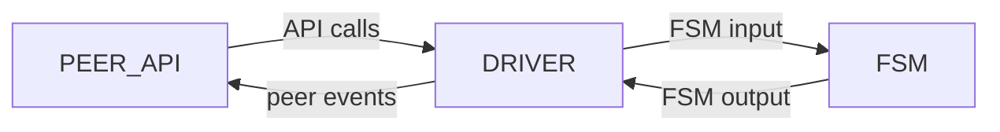
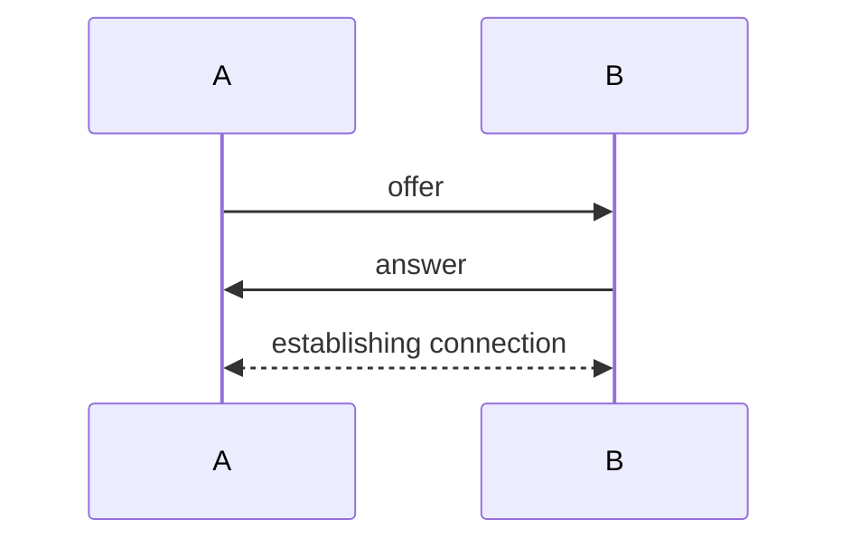
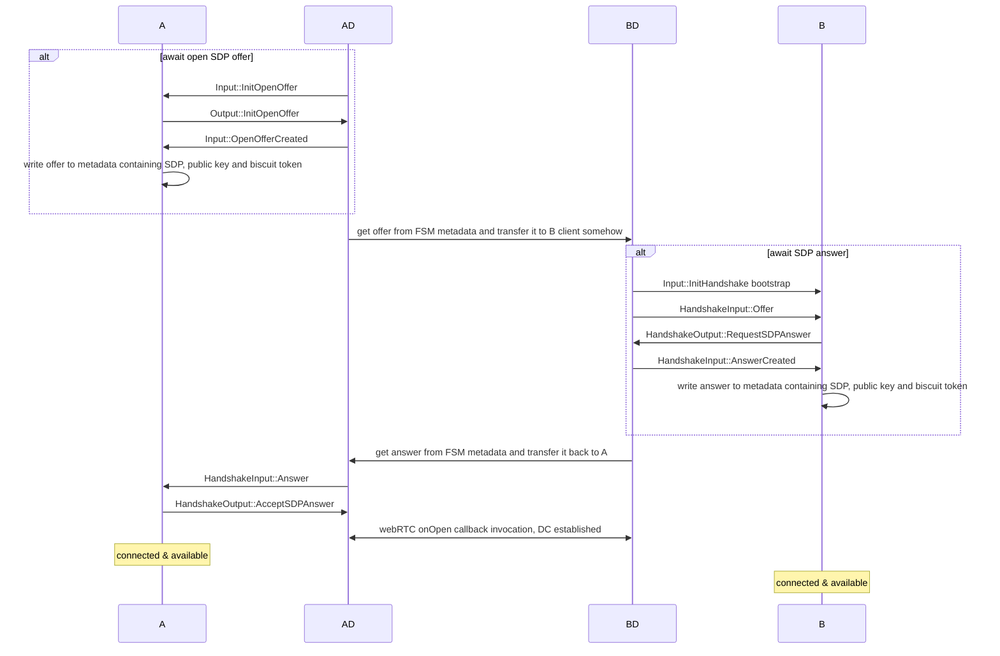
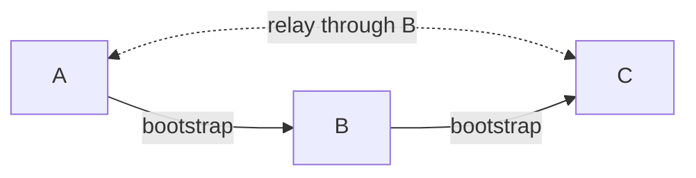
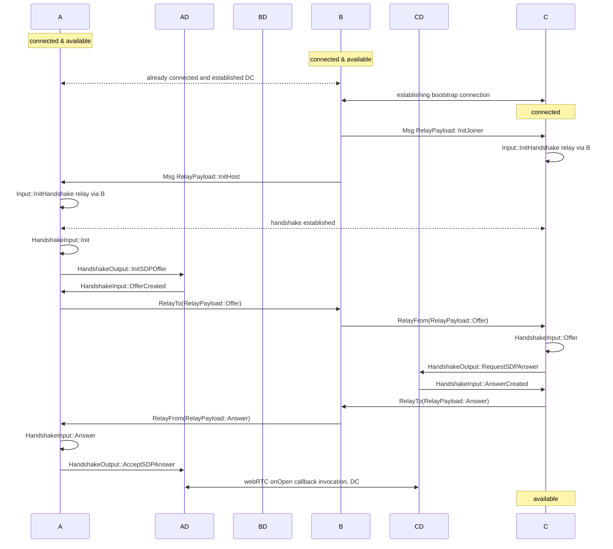

## Базовая информация

Antenna - SDP for building decentralized P2P over WebRTC. SDK спроектирован быть максимально гибким для пользователя,
используя при этом преимущества протокола webRTC, при этом полностью инкапсулируя его API и решая насущные задачи вроде
сигналинга и реконнекта самостоятельно. Antenna кросплатформенный SDK и может быть использован как в браузерных, так и в
нативных приложениях, хоть фокус на браузере. SDK построен на Antenna-protocol, о котором мы поговорим далее.

## Destription

## Peer structure

Пир состоит из трех вложенных модулей: Peer, Driver и FSM.

Peer является API-объектом, который используется для управления всеми сценариями пира. Он платформозависим, однако по
набору функций Peer для каждой платформы почти одинаков (подробнее в секции API).

Driver является платформеннозависимой прослойкой и обрабатывает ввод пользователя, обеспечивает вывод и управляет
внешними API: webRTC, персистентного хранилища. Driver реализован отдельно для каждой из платформ: в данный момент
поддерживается web и native. Управляет клиентскими событиями, переводит user-вызовы API в Input для FSM.

FSM - конечный автомат протокола, реализованный по sansIO-философии. является синхронным обработчиком и отвечает за всю
протокольную логику и управление состоянием подключений. Принимает Сообщения формата Input и возвращает Output, который
в дальнейшем обрабатывается драйвером.

# API

## Peer object

Главный рабочий объект библиотеки - Peer. API, предоставляемое Peer. его можно разделить на 3 категории: обеспечение
connecting, отправку сообщений и систему подписок на сообщения.

### Connection API

API соединений позволяет проводить bootstrap-соединение между двумя пирами и проводить graceful disconnection.

Оно состоит состоит из 4 методов:

- start - инициирует хандшейк, создавая и возвращая offer, и переводя пир в состояние ожидания ансвера.

- receive_offer - обрабатывает оффер, генерирует на его основе ансвер и возвращает его, переводя пир в состояние
  ожижания соединения по DataChannel

- receive_answer - обрабатывает ансвер и инициирует DataChannel-соединение между пирами, переводя обоих в Connected и
  позволяя начать отправлять сообщения

- leave - инициирует выход из меша, предварительно рассылая disconnect-сообщение всем пирам в меше.

### Sending API

Sending api позволяют отправлять сообщения другим пирам в меше

- send - отправить клиентское сообщение определенному пиру

- broadcast - отправить сообщение всем пирам в mesh.

### Subscription API

Subscription API позволяет подписываться на клиентские события Peer, для обработки различных событий. Всего есть 2
метода:

subscribe - подписаться на событие, возвращает идентификатор

unsubscribe - отписаться от события по идентификатору

Список возможных событий, на которые можно подписаться:

- Connected - текущий пир подключился к мешу
- UserMessage - пришло сообщение от другого пира
- Disconnected - текущий пир отсоединился
- PeerConnected - remote пир присоединился к мешу
- PeerDisconnected - remote пир отсоединился от меша
- PeerLost - remote пир непредсказуемо отсоединился (пропало соединение)
- Available - пир соединился со всеми в меше и готов к отправке сообщений (подключился и соединился с каждым в меше)
- Unavailable - пир не соединился со всеми в меше

## Signaling server

Signaling server - предоставляемый SDK хелпер, автоматизирующий bootstrap-соединения. Он управляет сущностями комнат,
включающих в себя подключенные пиры.

#### Спецификация Signaling сервера:

TODO написать на основе signaling-server

Тривиальная реализация signaling-сервера размещена в docker hub по ссылке:

## Signaling client

Signaling client - предоставляемый клиент сигналинг-сервера, которому делегируется peer connection api.

У клиента 2 метода:

- connect - подключить пир к серверу по WebSocket

- join - присоединиться к комнате

Также signaling-клиент устанавливает один listener на событие Disconnect, чтобы отправлять сообщение в комнату при
graceful дисконнекте пира.

### Driver

## Handshake

Для установки соединения между пирами необходимо провести хандшейк. В ходе antenna-хандшейка решается две проблемы:
обмен SDP-контрактами и распознавание IDENTITY друг друга (TODO написать подробнее).

Хандшейк спроектирован так, чтобы минимизировать делегацию сигналинг-части на юзера, но при этом не завязываться на
конкретном инструменте сигналинга. В ходе хандшейка два пира выбирают свои роли: Host и Joiner. В ходе хандшейка они
обмениваются информацией друг о друге, что позволяет установить соединение - offer, answer. Host отправляет offer, а
joiner принимает его и отправляет answer, после чего host initiates peer connection Абстракто, хэндшейк представляет из
себя следующую картину:

### Offer & Answer

Offer & Answer - handshake-объекты, по которым пиры узнают друг о друге. Сигналинг-объекты состоят из двух сущностей:
публичный ключ и подписанный им токен.

#### Публичный ключ

Является публичным ключем схемы ED25519, является также уникальным идентификатором пира в меше. Персистентен, способ
хранения зависит от платформы (local storage/файловая система).

#### Токен

Генерируется библиотекой biscuit, хранит в себе SDP-дескрипцию пира. SDP-дескрипция необходима, чтобы установить
соединение. Все содержимое токена подписывается публичным ключем и верифицируется при получении в другом пире.

### Handshake strategy

Стратегии хандшейка бывают 2 видов - Host и Joiner. Влияет только на то, кто из пиров инициирует negotiation. Любой пир
может быть и host, и joiner. По завершению хандшейка стратегия стирается, пиры становятся "равноправными".

#### Host

Пир, инициирующий negotiation. Упрощенно, жизненный цикл хоста состоит из следующих шагов:

1. Init, generate offer
2. Wait for answer, receive answer
3. Connect to other peer via DataChannel

#### Joiner

Пир, принимающий offer. Упрощенно, жизненный цикл джоинера состоит из следующих шагов:

1. receive offer, generate answer
2. wait for connection, connect

### Handshake mode

Режим хандшейка бывает двух видов: Bootstrap и Relay. TODO кратко описать различия

#### Bootstrap

Бутстрап соединению необходим внешний user-defined транспорт.

Подробная схема bootstrap-соединения:

#### Relay

Relay-хандшейк может произойти между двумя пирами, которые еще не подключены друг к другу, но при этом оба подключены к одному пиру. Relay-подключение происходит полностью под капотом - транспортом выступает DataChannel pipe через B. Благодаря relay-хандшейку каждый новый пир в меше требует лишь одно bootsrap-соединение - остальные проходят через relay.

Relay соединения инициируются в конце bootstrap-подключения: пусть пир B подключается к A, пир A подключен к пирам C, D. После подключения к пиру B, он отправит пирам C, D запросы на relay-соединения с пиром B, после завершения хандшейков меш станет полным. 

Подробная схема relay-соединения:

Важно отметить, что после прохождения хэндшейка и установки PeerConnection, иерархия между пирами "хост-джоинер"
пропадает и пиры становятся полностью равноправными.

## Peer connection

### Message format

Тип Antenna-сообщения полностью user-defined и должен лишь реализовывать Deserialize, Serialize и Clone, чтобы свободно
работать в рамках соединения. Сам способ сериализации определяется юзером.

### System messages

#### Relay

#### Disconnect

### Reconnecting