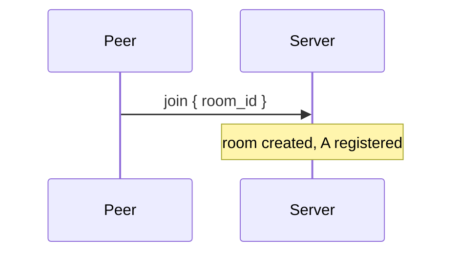
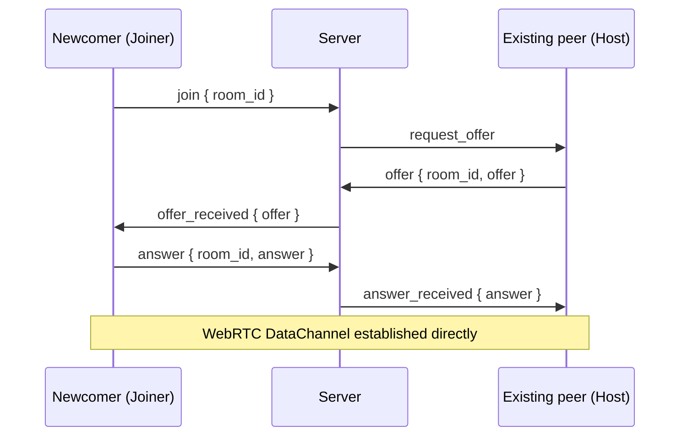

# Signaling server

Signaling server — a helper provided by the SDK that automates bootstrap connections. Manages rooms and the
peers connected to them.

## Transport

WebSocket, a single endpoint `GET /ws`. Each peer opens its own WS connection and keeps it open from the
moment it enters the room until it leaves.

## Message format

JSON WebSocket frames:

```js
{
    "type": TYPE,
    ...fields
}
```

Client-to-server messages:

| `type`       | Fields              | Purpose                      |
| ------------ | ------------------- | ---------------------------- |
| `join`       | `room_id`           | Enter the room               |
| `offer`      | `room_id`, `offer`  | Send an SDP offer as host    |
| `answer`     | `room_id`, `answer` | Send an SDP answer as joiner |
| `disconnect` | `room_id`           | Leave the room               |

Server-to-client messages:

| `type`            | Fields   | Purpose                                                        |
| ----------------- | -------- | -------------------------------------------------------------- |
| `request_offer`   | —        | "You are the host of this room, send an offer"                 |
| `offer_received`  | `offer`  | "You are the joiner, here is the host's offer, send an answer" |
| `answer_received` | `answer` | "Your offer was accepted, here is the joiner's answer"         |

`offer` and `answer` are opaque strings to the server. The server does not parse or validate them — that is the peer's responsibility
(see [protocol.md](./protocol.md) → Handshake).

## Scenarios

### Connect

The client opens a WebSocket on `GET /ws`. No messages are sent, and the peer does not yet enter a room — that happens
later, on `join`.

### Join an empty room

The client sends `join`. The server remembers the peer as the first participant of the room and does not respond.



### Join a non-empty room

The client sends `join`. The server picks any existing peer as the partner for the bootstrap handshake and forwards
three messages between it and the newcomer. Which of the two becomes the host and which the joiner is decided by the server; the client
only needs to react to the incoming `request_offer` or `offer_received`.



Client steps:

-   the host receives `request_offer` → calls `peer.start()` → sends the result in the `offer` field;
-   the joiner receives `offer_received` → calls `peer.receive_offer(offer)` → sends the result in the `answer` field;
-   the host receives `answer_received` → calls `peer.receive_answer(answer)`.

After that, signaling has done its job. Connecting to the remaining peers of the room happens by means of
the antenna protocol through a relay handshake (see [protocol.md](./protocol.md)).

### Disconnect

The client either explicitly sends `disconnect` or simply closes the WebSocket. For the server these two cases are equivalent — the peer
is removed from the room.

## Trivial implementation

A trivial implementation of the signaling server is hosted on docker hub at: https://hub.docker.com/repository/docker/quasarity/antenna-signaling-server
