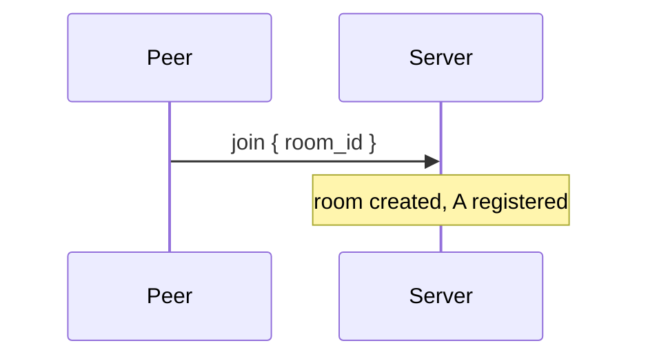
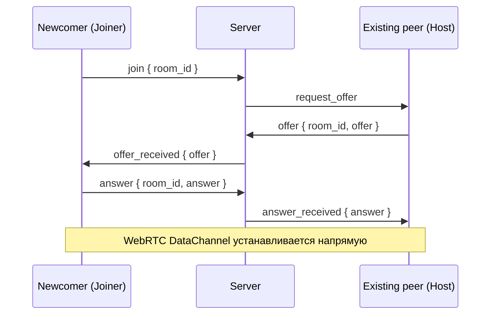

# Signaling server

Signaling server - предоставляемый SDK хелпер, автоматизирующий bootstrap-соединения. Управляет комнатами и
подключенными к ним пирами.

## Транспорт

WebSocket, единственный эндпойнт `GET /ws`. Каждый пир открывает собственное WS-соединение и держит его открытым с
момента входа в комнату до выхода.

## Формат сообщений

JSON WebSocket-фреймы:

```js
{
    "type": TYPE,
    ...fields
}
```

Сообщения клиента серверу:

| `type`       | Поля                | Назначение                     |
| ------------ | ------------------- | ------------------------------ |
| `join`       | `room_id`           | Войти в комнату                |
| `offer`      | `room_id`, `offer`  | Прислать SDP-offer как host    |
| `answer`     | `room_id`, `answer` | Прислать SDP-answer как joiner |
| `disconnect` | `room_id`           | Покинуть комнату               |

Сообщения сервера клиенту:

| `type`            | Поля     | Назначение                                        |
| ----------------- | -------- | ------------------------------------------------- |
| `request_offer`   | —        | "Ты — host этой комнаты, пришли offer"            |
| `offer_received`  | `offer`  | "Ты — joiner, вот offer от host'а, пришли answer" |
| `answer_received` | `answer` | "Твой offer принят, вот answer от joiner'а"       |

`offer` и `answer` для сервера - непрозрачные строки. Сервер их не парсит и не валидирует, за это отвечает peer
(см. [protocol.md](./protocol.md) → Handshake).

## Сценарии

### Connect

Клиент открывает WebSocket на `GET /ws`. Сообщений не отправляется, в комнату пир ещё не вступает - это произойдёт
позже, по `join`.

### Join в пустую комнату

Клиент шлёт `join`. Сервер запоминает peer'а как первого участника комнаты и ничего не отвечает.



### Join в непустую комнату

Клиент шлёт `join`. Сервер выбирает любого существующего peer'а как партнёра по bootstrap-handshake'у и пробрасывает
три сообщения между ним и новичком. Кто из двух становится host'ом, а кто joiner'ом - определяет сервер; клиенту
достаточно реагировать на пришедшее `request_offer` или `offer_received`.



Шаги клиентов:

- host получает `request_offer` → вызывает `peer.start()` → результат шлёт в поле `offer`;
- joiner получает `offer_received` → вызывает `peer.receive_offer(offer)` → результат шлёт в поле `answer`;
- host получает `answer_received` → вызывает `peer.receive_answer(answer)`.

После этого сигналинг свою задачу выполнил. Подключение к остальным peer'ам комнаты происходит уже силами
antenna-протокола через relay handshake (см. [protocol.md](./protocol.md)).

### Disconnect

Клиент либо явно шлёт `disconnect`, либо просто закрывает WebSocket. Для сервера эти два случая эквивалентны - peer
удаляется из комнаты.

## Тривиальная реализация

Тривиальная реализация signaling-сервера размещена в docker hub по ссылке: https://hub.docker.com/repository/docker/quasarity/antenna-signaling-server
