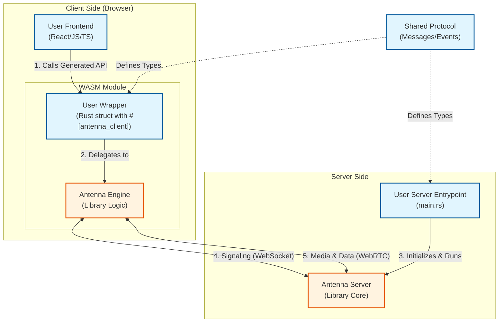

# Simple Group Chat

This example demonstrates a fullstack group chat application built with Antenna, featuring real-time messaging and voice calls.

## Application Architecture

This diagram illustrates how the application is built using Antenna, highlighting the separation between **User Code** and **Library Logic**.



## Running the Example

1.  **Start the Server:**
    ```bash
    cd server
    cargo run
    ```

2.  **Build the client engine via `antenna-cli`**
    ``` bash 
    cargo antenna build --shared ./shared --client ./wasm-lib --out ./client/src/generated
    ```

3.  **Start the Client:**
    ```bash
    cd client
    npm install
    npm run dev
    ```
